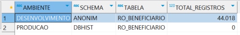
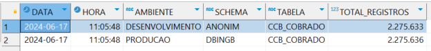
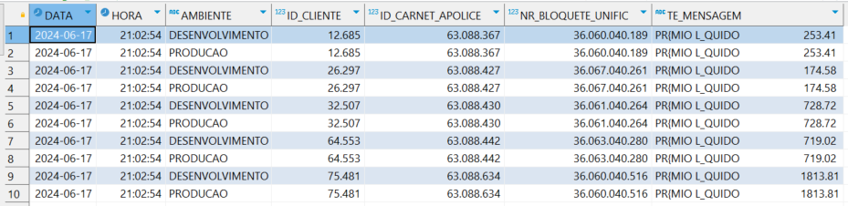

# Artefatos de Testes e Escopo de Validação - Anonimização de Dados
### Banco: INGENIUM
### jul/2024

------------

# SP_ANON001 - IPRD552.TBENE
#### Campos sensíveis:
- **BNFY_NM** - CHAR(54)

#### SQL principal da procedure:
```sql
UPDATE
    IPRD552 . TBENE
SET
    BNFY_NM = SUBSTRING(TRANSLATE(HEX(HASH_MD5(BNFY_NM)), 'ABCDEF', '789456'), 1, 54)
WHERE
    CO_ID = 'PB' AND
    CLI_ID = P_CLI_ID ;
```

#### Evidência 001.a - Contagem de registros ANTES da execução da procedure:
```sql
SELECT
	CURRENT DATE AS DATA,
	CURRENT TIME AS HORA,
	'DESENVOLVIMENTO' AS AMBIENTE,
	'ANONIM' AS SCHEMA,
	'TBENE' AS TABELA,
	COUNT(*) AS TOTAL_REGISTROS
FROM
	ANONIM.TBENE UNION ALL
SELECT
	CURRENT DATE AS DATA,
	CURRENT TIME AS HORA,
	'PRODUCAO' AS AMBIENTE,
	'IPRD552' AS SCHEMA,
	'TBENE' AS TABELA,
	COUNT(*) AS TOTAL_REGISTROS
FROM
	IPRD552.TBENE;
```
#### Output - Evidência 001.a:


#### Evidência 001.b - Análise comparativa dos dados ANTES da execução da procedure:
```sql
SELECT
	CURRENT DATE AS DATA,
	CURRENT TIME AS HORA,
    'DESENVOLVIMENTO' AS AMBIENTE,
    CO_ID,
    POL_ID,
    BNFY_SEQ_NUM,
    BNFY_NM,
    CLI_ID,
    CLI_ADDR_TYP_CD
FROM
    ANONIM.TBENE
WHERE
    CLI_ID IN (
        '0000064531', '0000064540', '0000105171', '0000104873'
    ) UNION ALL
SELECT
	CURRENT DATE AS DATA,
	CURRENT TIME AS HORA,
    'PRODUCAO' AS AMBIENTE,
    CO_ID,
    POL_ID,
    BNFY_SEQ_NUM,
    BNFY_NM,
    CLI_ID,
    CLI_ADDR_TYP_CD
FROM
    IPRD552.TBENE
WHERE
    CLI_ID IN (
        '0000064531', '0000064540', '0000105171', '0000104873'
    ) ORDER BY CLI_ID, AMBIENTE;
```
#### Output - Evidência 001.b:


### EXECUÇÃO DA PROCEDURE SP_ANON001
-----

### CLI_ID's escolhidas:
- ```0000064531```
- ```0000105171```

### Comando de execução da PROC:

```sql
CALL ANONIM.SP_ANON001('0000064531');

CALL ANONIM.SP_ANON001('0000105171');
```
-----
#### Evidência 001.c - Contagem de registros APÓS da execução da procedure:


1. Quantidade de registros nos dois ambientes permanece inalterada?
- SIM

#### Evidência 001.d - Análise comparativa de dados APÓS execução da procedure:


2. Campos sensíveis determinados pelo CLI_ID selecionado foram devidamente anonimizados?
- SIM
3. Campos não sensíveis permaneceram inalterados?
- SIM
4. Execução da procedure **SP_ANON001** bem-sucedida?
- SIM

---

# SP_ANON002 - DBINGB.RO_BENEFICIARIO
#### Campos sensíveis:
- **NM_BENEFICIARIO** - CHAR(75)
- **CD_CIC_BENEFICIARIO** - CHAR(15)
- **DT_NASC_BENEFICIARIO** - DATE

#### SQL principal da procedure:
```sql
UPDATE
    DBINGB.RO_BENEFICIARIO
SET
    NM_BENEFICIARIO = SUBSTRING(HEX(HASH_MD5(NM_BENEFICIARIO)), 1, 75 ),
    CD_CIC_BENEFICIARIO = SUBSTRING(TRANSLATE(HEX(HASH_MD5(CD_CIC_BENEFICIARIO)), '789456', 'ABCDEF'), 1, 10),
    DT_NASC_BENEFICIARIO = CURRENT DATE
WHERE
    CD_BENEFICIARIO = P_CLI_ID;
```

#### Evidência 002.a - Contagem de registros ANTES da execução da procedure:
```sql
SELECT
	CURRENT DATE AS DATA,
	CURRENT TIME AS HORA,
	'DESENVOLVIMENTO' AS AMBIENTE,
	'ANONIM' AS SCHEMA,
	'RO_BENEFICIARIO' AS TABELA,
	COUNT(*) AS TOTAL_REGISTROS
FROM
	ANONIM.RO_BENEFICIARIO UNION ALL
SELECT
	CURRENT DATE AS DATA,
	CURRENT TIME AS HORA,
	'PRODUCAO' AS AMBIENTE,
	'DBINGB' AS SCHEMA,
	'RO_BENEFICIARIO' AS TABELA,
	COUNT(*) AS TOTAL_REGISTROS
FROM
	DBINGB.RO_BENEFICIARIO;
```

#### Output - Evidência 002.a:


#### Evidência 002.b - Análise comparativa dos dados ANTES da execução da procedure:
```sql
SELECT
	CURRENT DATE AS DATA,
	CURRENT TIME AS HORA,
    'DESENVOLVIMENTO' AS AMBIENTE,
    DT_MOVIMENTO,
    NR_REGISTRO,
    NR_APOLICE_INGE,
    CD_BENEFICIARIO,
    NM_BENEFICIARIO,
    CD_CIC_BENEFICIARIO,
    DT_NASC_BENEFICIARIO
FROM
    ANONIM.RO_BENEFICIARIO
WHERE
    CD_BENEFICIARIO IN (
        '0000323302', '0000328972', '0000417971', '0000463221', '0000471497'
    ) UNION ALL
SELECT
	CURRENT DATE AS DATA,
	CURRENT TIME AS HORA,
    'PRODUCAO' AS AMBIENTE,
    DT_MOVIMENTO,
    NR_REGISTRO,
    NR_APOLICE_INGE,
    CD_BENEFICIARIO,
    NM_BENEFICIARIO,
    CD_CIC_BENEFICIARIO,
    DT_NASC_BENEFICIARIO
FROM
    DBINGB.RO_BENEFICIARIO
WHERE
    CD_BENEFICIARIO IN (
        '0000323302', '0000328972', '0000417971', '0000463221', '0000471497'
    ) ORDER BY CD_BENEFICIARIO , AMBIENTE;
```

#### Output - Evidência 002.b:


### EXECUÇÃO DA PROCEDURE SP_ANON002
-----

### CLI_ID's escolhidas:
- ```0000323302```
- ```0000417971```
- ```0000471497```

### Comando de execução da PROC:

```sql
CALL ANONIM.SP_ANON002('0000323302');

CALL ANONIM.SP_ANON002('0000417971');

CALL ANONIM.SP_ANON002('0000471497');
```
-----
#### Evidência 002.c - Contagem de registros APÓS da execução da procedure:


1. Quantidade de registros nos dois ambientes permanece inalterada?
- SIM

#### Evidência 002.d - Análise comparativa de dados APÓS execução da procedure:


2. Campos sensíveis determinados pelo CLI_ID selecionado foram devidamente anonimizados?
- SIM
3. Campos não sensíveis permaneceram inalterados?
- SIM
4. Execução da procedure **SP_ANON002** bem-sucedida?
- SIM

---

# SP_ANON003 - DBHIST.RO_BENEFICIARIO
## OBS: Tabela vazia no schema DBHIST
#### Campos sensíveis:
- **NM_BENEFICIARIO** - CHAR(75)
- **CD_CIC_BENEFICIARIO** - CHAR(15)
- **DT_NASC_BENEFICIARIO** - DATE(10)

#### SQL principal da procedure:
```sql
UPDATE
    DBHIST.RO_BENEFICIARIO
SET
    NM_BENEFICIARIO = SUBSTRING(HEX(HASH_MD5(NM_BENEFICIARIO)), 1, 75),
    CD_CIC_BENEFICIARIO = SUBSTRING(TRANSLATE(HEX(HASH_MD5 (CD_CIC_BENEFICIARIO)), '789456', 'ABCDEF'), 1, 10),
    DT_NASC_BENEFICIARIO = CURRENT DATE
WHERE
    CD_BENEFICIARIO = P_CLI_ID;
```

#### Evidência 003.a - Contagem de registros ANTES da execução da procedure:
```sql
SELECT
	CURRENT DATE AS DATA,
	CURRENT TIME AS HORA,
	'DESENVOLVIMENTO' AS AMBIENTE,
	'ANONIM' AS SCHEMA,
	'RO_BENEFICIARIO' AS TABELA,
	COUNT(*) AS TOTAL_REGISTROS
FROM
	ANONIM.RO_BENEFICIARIO UNION ALL
SELECT
	CURRENT DATE AS DATA,
	CURRENT TIME AS HORA,
	'PRODUCAO' AS AMBIENTE,
	'DBINGB' AS SCHEMA,
	'RO_BENEFICIARIO' AS TABELA,
	COUNT(*) AS TOTAL_REGISTROS
FROM
	DBINGB.RO_BENEFICIARIO;
```

#### Output - Evidência 003.a:


#### Evidência 003.b - Análise comparativa dos dados ANTES da execução da procedure:
```sql
SELECT
	'DESENVOLVIMENTO' AS DT_MOVIMENTO,
	NR_REGISTRO,
	NR_APOLICE_INGE,
	NR_DOCUMENTO,
	CD_BENEFICIARIO,
	NM_BENEFICIARIO,
	CD_SEXO_BENEFICIARIO,
	DT_NASC_BENEFICIARIO,
	CD_CIC_BENEFICIARIO,
	QT_PARTICIPACAO,
	VR_RENDA
FROM ANONIM.RO_BENEFICIARIO
WHERE
    CD_BENEFICIARIO IN (
        '0000181885', '0000244863', '0000304815', '0000307367', '0000321162'
    ) UNION ALL
SELECT 'PRODUCAO' AS AMBIENTE,
	NR_REGISTRO,
	NR_APOLICE_INGE,
	NR_DOCUMENTO,
	CD_BENEFICIARIO,
	NM_BENEFICIARIO,
	CD_SEXO_BENEFICIARIO,
	DT_NASC_BENEFICIARIO,
	CD_CIC_BENEFICIARIO,
	QT_PARTICIPACAO,
	VR_RENDA
FROM DBHIST.RO_BENEFICIARIO
WHERE
    CD_BENEFICIARIO IN (
        '0000181885', '0000244863', '0000304815', '0000307367', '0000321162'
    ) ORDER BY 6, 1;
```

#### Output - Evidência 003.b:


### EXECUÇÃO DA PROCEDURE SP_ANON003
-----

### CLI_ID's escolhidas:
- ```0000181885```
- ```0000304815```
- ```0000321162```

### Comando de execução da PROC:

```sql
CALL ANONIM.SP_ANON003('0000181885');

CALL ANONIM.SP_ANON003('0000304815');

CALL ANONIM.SP_ANON003('0000321162');
```
-----
#### Evidência 003.c - Contagem de registros APÓS a execução da procedure:


1. Quantidade de registros nos dois ambientes permanece inalterada?
- SIM

#### Evidência 003.d - Análise comparativa de dados APÓS execução da procedure:


2. Campos sensíveis determinados pelo CLI_ID selecionado foram devidamente anonimizados?
- NÃO, porque a tabela DBHIST.RO_BENEFICIARIO encontra-se vazia.
3. Campos não sensíveis permaneceram inalterados?
- Teste impossível de ser evidenciado.
4. Execução da procedure **SP_ANON003** bem-sucedida?
- NÃO, porque a tabela DBHIST.RO_BENEFICIARIO encontra-se vazia.

---

# SP_ANON004 - IPRD552.TIBEN
#### Campos sensíveis:
- **BNFY_NM** - CHAR(54)

#### SQL principal da procedure:
```sql
MERGE INTO
    IPRD552.TIBEN PR
        USING (
    SELECT
        T1.EXT_SYS_ID,
        T1.APPL_NUM,
        T1.SEQ_NUM
    FROM
        IPRD552.TIBEN T1
    INNER JOIN
        IPRD552.TIPOL T2
    ON
        T2.EXT_SYS_ID = T1.EXT_SYS_ID AND
        T2.APPL_NUM = T1.APPL_NUM
    INNER JOIN
        IPRD552.TBENE T3
    ON
        T3.CO_ID = 'PB' AND
        T3.POL_ID = T2.INGENIUM_POL_ID AND
        T3.BNFY_SEQ_NUM = T1.SEQ_NUM AND
        T3.CLI_ID = P_CLI_ID
    ) PR_A 
    ON (
        PR.EXT_SYS_ID = PR_A.EXT_SYS_ID AND
        PR.APPL_NUM = PR_A.APPL_NUM AND
        PR.SEQ_NUM = PR_A.SEQ_NUM
    ) WHEN MATCHED THEN
    UPDATE SET
        BNFY_NM = HEX(HASH_MD5(BNFY_NM));
```

#### Evidência 004.a - Contagem de registros ANTES da execução da procedure:
```sql
SELECT
	CURRENT DATE AS DATA,
	CURRENT TIME AS HORA,
	'DESENVOLVIMENTO' AS AMBIENTE,
	'ANONIM' AS SCHEMA,
	'TIBEN' AS TABELA,
	COUNT(*) AS TOTAL_REGISTROS
FROM
	ANONIM.TIBEN UNION ALL
SELECT
	CURRENT DATE AS DATA,
	CURRENT TIME AS HORA,
	'PRODUCAO' AS AMBIENTE,
	'IPRD552' AS SCHEMA,
	'TIBEN' AS TABELA,
	COUNT(*) AS TOTAL_REGISTROS
FROM
	IPRD552.TIBEN;
```

#### Output - Evidência 004.a:


#### Evidência 004.b - Análise comparativa dos dados ANTES da execução da procedure:
```sql
SELECT
	CURRENT DATE AS DATA,
	CURRENT TIME AS HORA,
	'DESENVOLVIMENTO' AS AMBIENTE,
	T1.APPL_NUM,
	T1.BNFY_NM,
	T2.INGENIUM_POL_ID,
	T3.BNFY_SEQ_NUM,
	T3.CLI_ID
FROM
	ANONIM.TIBEN T1
INNER JOIN
	IPRD552.TIPOL T2 
ON
	T2.EXT_SYS_ID = T1.EXT_SYS_ID AND
    T2.APPL_NUM = T1.APPL_NUM
INNER JOIN
    ANONIM.TBENE T3
ON
    T3.CO_ID = 'PB' AND
    T3.POL_ID = T2.INGENIUM_POL_ID AND
    T3.BNFY_SEQ_NUM = T1.SEQ_NUM AND
    T3.CLI_ID IN ('0000395888', '0000397464', '0000412321', '0000419546', '0000447783')
UNION ALL SELECT
	CURRENT DATE AS DATA,
	CURRENT TIME AS HORA,
	'PRODUCAO' AS AMBIENTE,
	T1.APPL_NUM,
	T1.BNFY_NM,
	T2.INGENIUM_POL_ID,
	T3.BNFY_SEQ_NUM,
	T3.CLI_ID
FROM
	IPRD552.TIBEN T1
INNER JOIN
	IPRD552.TIPOL T2 
ON
	T2.EXT_SYS_ID = T1.EXT_SYS_ID AND
    T2.APPL_NUM = T1.APPL_NUM
INNER JOIN
        IPRD552.TBENE T3
ON
    T3.CO_ID = 'PB' AND
    T3.POL_ID = T2.INGENIUM_POL_ID AND
    T3.BNFY_SEQ_NUM = T1.SEQ_NUM AND
    T3.CLI_ID IN ('0000395888', '0000397464', '0000412321', '0000419546', '0000447783')
ORDER BY CLI_ID, AMBIENTE;
```

#### Output - Evidência 004.b:


### EXECUÇÃO DA PROCEDURE SP_ANON004
-----

### CLI_ID's escolhidas:
- ```0000395888```
- ```0000412321```
- ```0000447783```

### Comando de execução da PROC:

```sql
CALL ANONIM.SP_ANON004('0000395888');

CALL ANONIM.SP_ANON004('0000412321');

CALL ANONIM.SP_ANON004('0000447783');
```
-----
#### Evidência 004.c - Contagem de registros APÓS da execução da procedure:


1. Quantidade de registros nos dois ambientes permanece inalterada?
- SIM

#### Evidência 004.d - Análise comparativa de dados APÓS execução da procedure:


1. Campos sensíveis determinados pelo CLI_ID selecionado foram devidamente anonimizados?
- SIM
1. Campos não sensíveis permaneceram inalterados?
- SIM
1. Execução da procedure **SP_ANON004** bem-sucedida?
- SIM

---

# SP_ANON005 - DBTCTO.TB_RESTRICOES_SEGURADO
#### Campos sensíveis:
- **NM_SEGURADO** - CHAR(75)
- **DT_NASC_SEGURADO** - DATE
- **CD_CEP** - CHAR(9)
- **DE_COMPLEMENTO** - CHAR(25)
- **DE_LOGRADOURO** - CHAR(60)

#### SQL principal da procedure:
```sql
UPDATE
    DBTCTO.TB_RESTRICOES_SEGURADO
SET
    NM_SEGURADO = SUBSTRING(TRANSLATE(HEX(HASH_MD5(NM_SEGURADO)), 'ABCDEF', '789456'), 1, 75),
    DT_NASC_SEGURADO = CURRENT DATE,
    CD_CEP = SUBSTRING(TRANSLATE(HEX(HASH_MD5(CD_CEP)), '789456', 'ABCDEF'), 1, 9),
    DE_COMPLEMENTO = SUBSTRING(TRANSLATE(HEX(HASH_MD5(DE_COMPLEMENTO)), 'ABCDEF', '789456'), 1, 25),
    DE_LOGRADOURO = SUBSTRING (TRANSLATE(HEX(HASH_MD5(DE_LOGRADOURO)), 'ABCDEF', '789456'), 1, 60)
WHERE
    CD_SEGURADO = P_CLI_ID;
```

#### Evidência 005.a - Contagem de registros ANTES da execução da procedure:
```sql
SELECT
	CURRENT DATE AS DATA,
	CURRENT TIME AS HORA,
	'DESENVOLVIMENTO' AS AMBIENTE,
	'ANONIM' AS SCHEMA,
	'TB_RESTRICOES_SEGURADO' AS TABELA,
	COUNT(*) AS TOTAL_REGISTROS
FROM
	ANONIM.TB_RESTRICOES_SEGURADO UNION ALL
SELECT
	CURRENT DATE AS DATA,
	CURRENT TIME AS HORA,
	'PRODUCAO' AS AMBIENTE,
	'DBTCTO' AS SCHEMA,
	'TB_RESTRICOES_SEGURADO' AS TABELA,
	COUNT(*) AS TOTAL_REGISTROS
FROM
	DBTCTO.TB_RESTRICOES_SEGURADO;
```

#### Output - Evidência 005.a:


#### Evidência 005.b - Análise comparativa dos dados ANTES da execução da procedure:
```sql
WITH part_1 AS (
	SELECT
		ROW_NUMBER() OVER (PARTITION BY CD_SEGURADO ORDER BY CD_SEGURADO) AS ROW_N,
		'DESENVOLVIMENTO' AS AMBIENTE,
		DT_RESTRICAO,
		CD_CONTROLE_SEGURADO,
		CD_VERIFICADOR_SEGURADO,
		CD_SEGURADO,
		NM_SEGURADO,
		CD_SEXO_SEGURADO,
		DT_NASC_SEGURADO,
		DE_LOGRADOURO,
		DE_COMPLEMENTO,
		CD_UF,
		CD_CEP
	FROM
		ANONIM.TB_RESTRICOES_SEGURADO
	WHERE 
		CD_SEGURADO IN ('0000279735', '0000332980', '0000218783', '0000245843', '0000231676')
	UNION ALL SELECT
		ROW_NUMBER() OVER (PARTITION BY CD_SEGURADO ORDER BY CD_SEGURADO) AS ROW_N,
		'PRODUCAO' AS AMBIENTE,
		DT_RESTRICAO,
		CD_CONTROLE_SEGURADO,
		CD_VERIFICADOR_SEGURADO,
		CD_SEGURADO,
		NM_SEGURADO,
		CD_SEXO_SEGURADO,
		DT_NASC_SEGURADO,
		DE_LOGRADOURO,
		DE_COMPLEMENTO,
		CD_UF,
		CD_CEP
	FROM
		DBTCTO.TB_RESTRICOES_SEGURADO
	WHERE 
		CD_SEGURADO IN ('0000279735', '0000332980', '0000218783', '0000245843', '0000231676')
	ORDER BY 5, 1
), part_2 AS (SELECT ROW_N, AMBIENTE, DT_RESTRICAO, CD_CONTROLE_SEGURADO, CD_VERIFICADOR_SEGURADO, CD_SEGURADO, NM_SEGURADO, CD_SEXO_SEGURADO, DT_NASC_SEGURADO, DE_LOGRADOURO, DE_COMPLEMENTO, CD_UF, CD_CEP FROM part_1)
SELECT
	AMBIENTE,
	DT_RESTRICAO,
	CD_CONTROLE_SEGURADO,
	CD_VERIFICADOR_SEGURADO,
	CD_SEGURADO,
	NM_SEGURADO,
	CD_SEXO_SEGURADO,
	DT_NASC_SEGURADO,
	DE_LOGRADOURO,
	DE_COMPLEMENTO,
	CD_UF,
	CD_CEP
FROM
	part_2
WHERE
	ROW_N = 1
ORDER BY 
	CD_SEGURADO, AMBIENTE;
```

#### Output - Evidência 005.b:


### EXECUÇÃO DA PROCEDURE SP_ANON005
-----

### CLI_ID's escolhidas:
- ```0000279735```
- ```0000218783```
- ```0000231676```

### Comando de execução da PROC:

```sql
CALL ANONIM.SP_ANON005('0000279735');

CALL ANONIM.SP_ANON005('0000218783');

CALL ANONIM.SP_ANON005('0000231676');
```
-----
#### Evidência 005.c - Contagem de registros APÓS da execução da procedure:


1. Quantidade de registros nos dois ambientes permanece inalterada?
- SIM

#### Evidência 005.d - Análise comparativa de dados APÓS execução da procedure:


2. Campos sensíveis determinados pelo CLI_ID selecionado foram devidamente anonimizados?
- SIM
3. Campos não sensíveis permaneceram inalterados?
- SIM
4. Execução da procedure **SP_ANON005** bem-sucedida?
- SIM

---

# SP_ANON006 - DBINGB.RO_SEGURADO
#### Campos sensíveis:
- **NM_SEGURADO** - CHAR(75)
- **CD_CIC_SEGURADO** - CHAR(15)
- **DT_NASC_SEGURADO** - DATE

#### SQL principal da procedure:
```sql
UPDATE
    DBINGB.RO_SEGURADO
SET
    NM_SEGURADO = SUBSTRING(TRANSLATE(HEX(HASH_MD5(NM_SEGURADO)), 'ABCDEF', '789456'), 1, 75 ),
    CD_CIC_SEGURADO = SUBSTRING(TRANSLATE(HEX(HASH_MD5(CD_CIC_SEGURADO)), 'ABCDEF', '789456'), 1, 15),
    DT_NASC_SEGURADO = CURRENT DATE
WHERE
    CD_SEGURADO = P_CLI_ID;
```

#### Evidência 006.a - Contagem de registros ANTES da execução da procedure:
```sql
SELECT
	CURRENT DATE AS DATA,
	CURRENT TIME AS HORA, 
	'DESENVOLVIMENTO' AS AMBIENTE,
	'ANONIM' AS SCHEMA,
	'RO_SEGURADO' AS TABELA,
	COUNT(*) AS TOTAL_REGISTROS
FROM
	ANONIM.RO_SEGURADO UNION ALL
SELECT
	CURRENT DATE AS DATA,
	CURRENT TIME AS HORA, 
	'PRODUCAO' AS AMBIENTE,
	'DBINGB' AS SCHEMA,
	'RO_SEGURADO' AS TABELA,
	COUNT(*) AS TOTAL_REGISTROS
FROM
	DBINGB.RO_SEGURADO;
```

#### Output - Evidência 006.a:


#### Evidência 006.b - Análise comparativa dos dados ANTES da execução da procedure:
```sql
SELECT
	DATA,
	HORA,
	AMBIENTE,
	NR_REGISTRO,
	NR_APOLICE_INGE,
	CD_SEGURADO,
	NM_SEGURADO,
	CD_SEXO_SEGURADO,
	DT_NASC_SEGURADO,
	CD_CIC_SEGURADO,
	CD_UF_RESIDENCIA,
	VR_RENDA
FROM (
	SELECT ROW_NUMBER() OVER (PARTITION BY CD_SEGURADO, AMBIENTE ORDER BY CD_SEGURADO, AMBIENTE) AS ROW_N, DATA, HORA, AMBIENTE, NR_REGISTRO, NR_APOLICE_INGE, CD_SEGURADO, NM_SEGURADO, CD_SEXO_SEGURADO, DT_NASC_SEGURADO, CD_CIC_SEGURADO, CD_UF_RESIDENCIA, VR_RENDA FROM (
		SELECT
			CURRENT DATE AS DATA,
			CURRENT TIME AS HORA,
			'DESENVOLVIMENTO' AS AMBIENTE,
			NR_REGISTRO,
			NR_APOLICE_INGE,
			CD_SEGURADO,
			NM_SEGURADO,
			CD_SEXO_SEGURADO,
			DT_NASC_SEGURADO,
			CD_CIC_SEGURADO,
			CD_UF_RESIDENCIA,
			VR_RENDA
		FROM
			ANONIM.RO_SEGURADO
		WHERE
			CD_SEGURADO IN ('0000067587', '0000463722', '0000482224', '0000563232', '0000569547')
		UNION ALL SELECT
			CURRENT DATE AS DATA,
			CURRENT TIME AS HORA,
			'PRODUCAO' AS AMBIENTE,
			NR_REGISTRO,
			NR_APOLICE_INGE,
			CD_SEGURADO,
			NM_SEGURADO,
			CD_SEXO_SEGURADO,
			DT_NASC_SEGURADO,
			CD_CIC_SEGURADO,
			CD_UF_RESIDENCIA,
			VR_RENDA
		FROM
			DBINGB.RO_SEGURADO
		WHERE
			CD_SEGURADO IN ('0000067587', '0000463722', '0000482224', '0000563232', '0000569547')
	)
)
WHERE
	ROW_N = 1;
```

#### Output - Evidência 006.b:


### EXECUÇÃO DA PROCEDURE SP_ANON006
-----

### CLI_ID's escolhidas:
- ```0000067587```
- ```0000482224```
- ```0000569547```

### Comando de execução da PROC:

```sql
CALL ANONIM.SP_ANON006('0000067587');

CALL ANONIM.SP_ANON006('0000482224');

CALL ANONIM.SP_ANON006('0000569547');
```
-----
#### Evidência 006.c - Contagem de registros APÓS da execução da procedure:


1. Quantidade de registros nos dois ambientes permanece inalterada?
- SIM

#### Evidência 006.d - Análise comparativa de dados APÓS execução da procedure:


2. Campos sensíveis determinados pelo CLI_ID selecionado foram devidamente anonimizados?
- SIM
3. Campos não sensíveis permaneceram inalterados?
- SIM
4. Execução da procedure **SP_ANON006** bem-sucedida?
- SIM

---

# SP_ANON007 - DBHIST.RO_SEGURADO
#### Campos sensíveis:
- **NM_SEGURADO** - CHAR(75)
- **CD_CIC_SEGURADO** - CHAR(15)
- **DT_NASC_SEGURADO** - DATE

#### SQL principal da procedure:
```sql
UPDATE
    DBHIST.RO_SEGURADO
SET
    NM_SEGURADO = SUBSTRING(TRANSLATE(HEX(HASH_MD5(NM_SEGURADO)), 'ABCDEF', '789456'), 1, 75 ),
    CD_CIC_SEGURADO = SUBSTRING(TRANSLATE(HEX(HASH_MD5(CD_CIC_SEGURADO)), 'ABCDEF', '789456'), 1, 15),
    DT_NASC_SEGURADO = CURRENT DATE
WHERE
    CD_SEGURADO = P_CLI_ID;
```

#### Evidência 007.a - Contagem de registros ANTES da execução da procedure:
```sql
SELECT
	CURRENT DATE AS DATA,
	CURRENT TIME AS HORA,
	'DESENVOLVIMENTO' AS AMBIENTE,
	'ANONIM' AS SCHEMA,
	'RO_SEGURADO' AS TABELA,
	COUNT(*) AS TOTAL_REGISTROS
FROM
	ANONIM.RO_SEGURADO UNION ALL
SELECT
	CURRENT DATE AS DATA,
	CURRENT TIME AS HORA, 
	'PRODUCAO' AS AMBIENTE,
	'DBHIST' AS SCHEMA,
	'RO_SEGURADO' AS TABELA,
	COUNT(*) AS TOTAL_REGISTROS
FROM
	DBHIST.RO_SEGURADO;
```

#### Output - Evidência 007.a:


#### Evidência 007.b - Análise comparativa dos dados ANTES da execução da procedure:
```sql
SELECT
	DATA,
	HORA,
	AMBIENTE,
	NR_REGISTRO,
	NR_APOLICE_INGE,
	CD_SEGURADO,
	NM_SEGURADO,
	CD_SEXO_SEGURADO,
	DT_NASC_SEGURADO,
	CD_CIC_SEGURADO,
	CD_UF_RESIDENCIA,
	VR_RENDA
FROM (
	SELECT ROW_NUMBER() OVER (PARTITION BY CD_SEGURADO, AMBIENTE ORDER BY CD_SEGURADO, AMBIENTE) AS ROW_N, DATA, HORA, AMBIENTE, NR_REGISTRO, NR_APOLICE_INGE, CD_SEGURADO, NM_SEGURADO, CD_SEXO_SEGURADO, DT_NASC_SEGURADO, CD_CIC_SEGURADO, CD_UF_RESIDENCIA, VR_RENDA FROM (
		SELECT
			CURRENT DATE AS DATA,
			CURRENT TIME AS HORA,
			'DESENVOLVIMENTO' AS AMBIENTE,
			NR_REGISTRO,
			NR_APOLICE_INGE,
			CD_SEGURADO,
			NM_SEGURADO,
			CD_SEXO_SEGURADO,
			DT_NASC_SEGURADO,
			CD_CIC_SEGURADO,
			CD_UF_RESIDENCIA,
			VR_RENDA
		FROM
			ANONIM.RO_SEGURADO
		WHERE
			CD_SEGURADO IN ('0000067587', '0000463722', '0000482224', '0000563232', '0000569547')
		UNION ALL SELECT
			CURRENT DATE AS DATA,
			CURRENT TIME AS HORA,
			'PRODUCAO' AS AMBIENTE,
			NR_REGISTRO,
			NR_APOLICE_INGE,
			CD_SEGURADO,
			NM_SEGURADO,
			CD_SEXO_SEGURADO,
			DT_NASC_SEGURADO,
			CD_CIC_SEGURADO,
			CD_UF_RESIDENCIA,
			VR_RENDA
		FROM
			DBHIST.RO_SEGURADO
		WHERE
			CD_SEGURADO IN ('0000067587', '0000463722', '0000482224', '0000563232', '0000569547')
	)
)
WHERE
	ROW_N = 1;
```

#### Output - Evidência 007.b:


### EXECUÇÃO DA PROCEDURE SP_ANON007
-----

### CLI_ID's escolhidas:
- ```0000067587```
- ```0000482224```
- ```0000569547```

### Comando de execução da PROC:

```sql
CALL ANONIM.SP_ANON007('0000067587');

CALL ANONIM.SP_ANON007('0000482224');

CALL ANONIM.SP_ANON007('0000569547');
```
-----
#### Evidência 007.c - Contagem de registros APÓS da execução da procedure:


1. Quantidade de registros nos dois ambientes permanece inalterada?
- SIM

#### Evidência 007.d - Análise comparativa de dados APÓS execução da procedure:


2. Campos sensíveis determinados pelo CLI_ID selecionado foram devidamente anonimizados?
- SIM
3. Campos não sensíveis permaneceram inalterados?
- SIM
4. Execução da procedure **SP_ANON007** bem-sucedida?
- SIM

---

# SP_ANON008 - DBINGB.RO_ESTIPULANTE (TABELA VAZIA NOS SCHEMAS ANONIM E DBINGB)
#### Campos sensíveis:
- **CD_CIC_ESTIPULANTE** - CHAR(15)
- **DT_NASC_ESTIPULANTE** - DATE
- **CD_ESTIPULANTE** - CHAR(10)

#### SQL principal da procedure:
```sql
UPDATE
    DBINGB.RO_ESTIPULANTE
SET
    CD_CIC_ESTIPULANTE = SUBSTRING(TRANSLATE(HEX(HASH_MD5(CD_CIC_ESTIPULANTE)), '789456', 'ABCDEF'), 1, 15),
    DT_NASC_ESTIPULANTE = CURRENT DATE ,
    NM_ESTIPULANTE = HEX(HASH_MD5(NM_ESTIPULANTE))
WHERE
    CD_ESTIPULANTE = P_CLI_ID;
```

#### Evidência 008.a - Contagem de registros ANTES da execução da procedure:
```sql
SELECT
	CURRENT DATE AS DATA,
	CURRENT TIME AS HORA,
	'DESENVOLVIMENTO' AS AMBIENTE,
	'ANONIM' AS SCHEMA,
	'RO_ESTIPULANTE' AS TABELA,
	COUNT(*) AS TOTAL_REGISTROS
FROM
	ANONIM.RO_ESTIPULANTE UNION ALL
SELECT
	CURRENT DATE AS DATA,
	CURRENT TIME AS HORA, 
	'PRODUCAO' AS AMBIENTE,
	'DBINGB' AS SCHEMA,
	'RO_ESTIPULANTE' AS TABELA,
	COUNT(*) AS TOTAL_REGISTROS
FROM
	DBINGB.RO_ESTIPULANTE;
```

#### Output - Evidência 008.a:


#### Evidência 008.b - Análise comparativa dos dados ANTES da execução da procedure:
### OBS: Análise impossível de ser realizada, tabelas vazias em ambos schemas

### EXECUÇÃO DA PROCEDURE SP_ANON008
## OBS: Execução ineficaz, tabelas vazias em ambos schemas
-----

#### Evidência 008.c - Contagem de registros APÓS da execução da procedure:
### OBS: Serve como evidência print anterior

1. Quantidade de registros nos dois ambientes permanece inalterada?
- SIM

#### Evidência 008.d - Análise comparativa de dados APÓS execução da procedure:
### OBS: Análise impossível de ser realizada, tabelas vazias em ambos schemas

#### Output - Evidência 008.d:

2. Campos sensíveis determinados pelo CLI_ID selecionado foram devidamente anonimizados?
- NÃO, porque a tabela DBINGB.RO_ESTIPULANTE encontra-se vazia.
3. Campos não sensíveis permaneceram inalterados?
- Teste impossível de ser evidenciado.
4. Execução da procedure **SP_ANON008** bem-sucedida?
- NÃO, porque a tabela DBINGB.RO_ESTIPULANTE encontra-se vazia.

---

# SP_ANON009 - DBINGB.CCB_COBRADO
#### Campos sensíveis:
- **NR_CONTA_COBRANCA** - CHAR(11)
- **NR_CPFCNPJ_COBRANCA** - CHAR(14)

#### SQL principal da procedure:
```sql
UPDATE
    DBINGB.CCB_COBRADO
SET
    NR_CONTA_COBRANCA = SUBSTRING(TRANSLATE(HEX(HASH_MD5(NR_CONTA_COBRANCA)), '789456', 'ABCDEF'), 1, 11),
    NR_CPFCNPJ_COBRANCA = SUBSTRING(TRANSLATE(HEX(HASH_MD5(NR_CPFCNPJ_COBRANCA)), '789456', 'ABCDEF'), 1, 14)
WHERE
    NR_DOCUMENTO_ORIGE IN
(
    SELECT
        T1.NR_DOCUMENTO_ORIGE
    FROM
        (
        SELECT DISTINCT
            NR_DOCUMENTO_ORIGE
        FROM
            DBINGB.CCB_COBRADO
        WHERE
            LENGTH(TRIM(NR_CPFCNPJ_COBRANCA)) <> 0
) T1
    INNER JOIN
        IPRD552.TPOL T2
    ON
        T2.APPL_NUM_ID = T1.NR_DOCUMENTO_ORIGE
    INNER JOIN
        IPRD552.TPOLC T3
    ON
        T3.CO_ID = 'PB' AND
        T3.POL_ID = T2.POL_ID AND
        T3.POL_CLI_REL_TYP_CD = 'O'
    INNER JOIN
        IPRD552.TCLI T4
    ON
        T4.CO_ID = '  ' AND
        T4.CLI_ID = T3.CLI_ID AND
        T4.CLI_ID = P_CLI_ID
);
```

#### Evidência 009.a - Contagem de registros ANTES da execução da procedure:
```sql
SELECT
	CURRENT DATE AS DATA,
	CURRENT TIME AS HORA,
	'DESENVOLVIMENTO' AS AMBIENTE,
	'ANONIM' AS SCHEMA,
	'CCB_COBRADO' AS TABELA,
	COUNT(*) AS TOTAL_REGISTROS
FROM
	ANONIM.CCB_COBRADO UNION ALL
SELECT
	CURRENT DATE AS DATA,
	CURRENT TIME AS HORA, 
	'PRODUCAO' AS AMBIENTE,
	'DBINGB' AS SCHEMA,
	'CCB_COBRADO' AS TABELA,
	COUNT(*) AS TOTAL_REGISTROS
FROM
	DBINGB.CCB_COBRADO;
```

#### Output - Evidência 009.a:


#### Evidência 009.b - Análise comparativa dos dados ANTES da execução da procedure:
```sql
SELECT
	CURRENT DATE AS DATA,
	CURRENT TIME AS HORA,
	'DESENVOLVIMENTO' AS AMBIENTE,
	T1.CO_ID,
	T1.NR_RECIBO_PROVISOR,
	T1.NR_DOCUMENTO_ORIGE,
	T1.DT_EMISSAO,
	T1.NM_PROPONENTE,
	T1.CD_BANCO_COBRANCA,
	T1.NR_CONTA_COBRANCA,
	T1.NR_CPFCNPJ_COBRANCA,
	T4.CLI_ID
FROM
	ANONIM.CCB_COBRADO T1
INNER JOIN
	IPRD552.TPOL T2
ON
	T2.APPL_NUM_ID = T1.NR_DOCUMENTO_ORIGE
INNER JOIN
    IPRD552.TPOLC T3
ON
    T3.CO_ID = 'PB' AND
    T3.POL_ID = T2.POL_ID AND
    T3.POL_CLI_REL_TYP_CD = 'O'
INNER JOIN
    ANONIM.TCLI T4
ON
    T4.CO_ID = '  ' AND
    T4.CLI_ID = T3.CLI_ID
WHERE
	T1.NR_CONTA_COBRANCA != '           ' AND
	T1.NR_CPFCNPJ_COBRANCA != '              ' AND
	T4.CLI_ID IN ('0000072706', '0000073097', '0000068596', '0000196075', '0000233045')
UNION ALL SELECT
	CURRENT DATE AS DATA,
	CURRENT TIME AS HORA,
	'PRODUCAO' AS AMBIENTE,
	T1.CO_ID,
	T1.NR_RECIBO_PROVISOR,
	T1.NR_DOCUMENTO_ORIGE,
	T1.DT_EMISSAO,
	T1.NM_PROPONENTE,
	T1.CD_BANCO_COBRANCA,
	T1.NR_CONTA_COBRANCA,
	T1.NR_CPFCNPJ_COBRANCA,
	T4.CLI_ID
FROM
	DBINGB.CCB_COBRADO T1
INNER JOIN
	IPRD552.TPOL T2
ON
	T2.APPL_NUM_ID = T1.NR_DOCUMENTO_ORIGE
INNER JOIN
    IPRD552.TPOLC T3
ON
    T3.CO_ID = 'PB' AND
    T3.POL_ID = T2.POL_ID AND
    T3.POL_CLI_REL_TYP_CD = 'O'
INNER JOIN
    IPRD552.TCLI T4
ON
    T4.CO_ID = '  ' AND
    T4.CLI_ID = T3.CLI_ID
WHERE
	T1.NR_CONTA_COBRANCA != '           ' AND
	T1.NR_CPFCNPJ_COBRANCA != '              ' AND
	T4.CLI_ID IN ('0000072706', '0000073097', '0000068596', '0000196075', '0000233045')
ORDER BY 
	12, 3;
```

#### Output - Evidência 009.b:


### EXECUÇÃO DA PROCEDURE SP_ANON009
-----

### CLI_ID's escolhidas:
- ```0000072706```
- ```0000068596```
- ```0000233045```

### Comando de execução da PROC:

```sql
CALL ANONIM.SP_ANON009('0000072706');

CALL ANONIM.SP_ANON009('0000068596');

CALL ANONIM.SP_ANON009('0000233045');
```
-----
#### Evidência 009.c - Contagem de registros APÓS da execução da procedure:


1. Quantidade de registros nos dois ambientes permanece inalterada?
- SIM

#### Evidência 009.d - Análise comparativa de dados APÓS execução da procedure:


2. Campos sensíveis determinados pelo CLI_ID selecionado foram devidamente anonimizados?
- SIM
3. Campos não sensíveis permaneceram inalterados?
- SIM
4. Execução da procedure **SP_ANON009** bem-sucedida?
- SIM

---

# SP_ANON010 - DBINGB.EMISSAO
#### Campos sensíveis:
- **BENEFICIARIO1** - CHAR(30)
- **BENEFICIARIO2** - CHAR(30)
- **BENEFICIARIO3** - CHAR(30)
- **CONTA** - DECIMAL(10, 0)
- **DIG_CONTA** - DECIMAL(1, 0)
- **ENDERECO_PROP** - CHAR(75)
- **NOME_SEGURADO** - CHAR(75)
- **NR_CEP** - INTEGER
- **NR_CPF_CGC** - DECIMAL(15, 0)

#### SQL principal da procedure:
```sql
UPDATE
    DBINGB.EMISSAO
SET
    BENEFICIARIO1 = SUBSTRING(HEX(HASH_MD5(BENEFICIARIO1)), 1, 30),
    
    BENEFICIARIO2 = SUBSTRING(HEX(HASH_MD5(BENEFICIARIO2)), 1, 30),
    
    BENEFICIARIO3 = SUBSTRING(HEX(HASH_MD5(BENEFICIARIO3)), 1, 30),
    
    CONTA = SUBSTRING(TRANSLATE(HEX(HASH_MD5(CONTA)), '789456', 'ABCDEF'), 1, 10),
    
    DIG_CONTA = SUBSTRING(TRANSLATE(HEX(HASH_MD5(DIG_CONTA)), '789456', 'ABCDEF'), 1, 1),
    
    ENDERECO_PROP = HEX(HASH_MD5(ENDERECO_PROP)),
    
    NOME_SEGURADO = HEX(HASH_MD5(NOME_SEGURADO)),
    
    NR_CEP = SUBSTRING(TRANSLATE(HEX(HASH_MD5(NR_CEP)), '789456', 'ABCDEF'), 1, 9),
    
    NR_CPF_CGC = SUBSTRING(TRANSLATE(HEX(HASH_MD5(NR_CPF_CGC)), '789456', 'ABCDEF'), 1, 15)
WHERE
    CD_CLIENTE = P_CLI_ID;
```

#### Evidência 010.a - Contagem de registros ANTES da execução da procedure:
```sql
SELECT
	CURRENT DATE AS DATA,
	CURRENT TIME AS HORA,
	'DESENVOLVIMENTO' AS AMBIENTE,
	'ANONIM' AS SCHEMA,
	'EMISSAO' AS TABELA,
	COUNT(*) AS TOTAL_REGISTROS
FROM
	ANONIM.EMISSAO UNION ALL
SELECT
	CURRENT DATE AS DATA,
	CURRENT TIME AS HORA, 
	'PRODUCAO' AS AMBIENTE,
	'DBINGB' AS SCHEMA,
	'EMISSAO' AS TABELA,
	COUNT(*) AS TOTAL_REGISTROS
FROM
	DBINGB.EMISSAO;
```

#### Output - Evidência 010.a:


#### Evidência 010.b - Análise comparativa dos dados ANTES da execução da procedure:
```sql
SELECT
	DATA,
	HORA,
	AMBIENTE,
	CD_CLIENTE,
	NR_APOLICE,
	NR_APOLICE_ING,
	BENEFICIARIO1,
	BENEFICIARIO2,
	BENEFICIARIO3,
	CONTA,
	DIG_CONTA,
	ENDERECO_PROP,
	NOME_SEGURADO,
	NR_CEP,
	NR_CPF_CGC,
	PREMIO_LIQUIDO
FROM (
	SELECT
		CURRENT DATE AS DATA,
		CURRENT TIME AS HORA,
		'DESENVOLVIMENTO' AS AMBIENTE,
		ROW_NUMBER() OVER (PARTITION BY CD_CLIENTE ORDER BY CD_CLIENTE) AS ROW_N,
		CD_CLIENTE,
		NR_APOLICE,
		NR_APOLICE_ING,
		BENEFICIARIO1,
		BENEFICIARIO2,
		BENEFICIARIO3,
		CONTA,
		DIG_CONTA,
		ENDERECO_PROP,
		NOME_SEGURADO,
		NR_CEP,
		NR_CPF_CGC,
		PREMIO_LIQUIDO
	FROM
		ANONIM.EMISSAO
	WHERE 
		CD_CLIENTE != '          ' AND
		BENEFICIARIO1 != '                              ' AND 
		BENEFICIARIO2 != '                              ' AND 
		BENEFICIARIO3 != '                              '
	UNION ALL SELECT
		CURRENT DATE AS DATA,
		CURRENT TIME AS HORA,
		'PRODUCAO' AS AMBIENTE,
		ROW_NUMBER() OVER (PARTITION BY CD_CLIENTE ORDER BY CD_CLIENTE) AS ROW_N,
		CD_CLIENTE,
		NR_APOLICE,
		NR_APOLICE_ING,
		BENEFICIARIO1,
		BENEFICIARIO2,
		BENEFICIARIO3,
		CONTA,
		DIG_CONTA,
		ENDERECO_PROP,
		NOME_SEGURADO,
		NR_CEP,
		NR_CPF_CGC,
		PREMIO_LIQUIDO
	FROM
		DBINGB.EMISSAO
	WHERE 
		CD_CLIENTE != '          ' AND
		BENEFICIARIO1 != '                              ' AND 
		BENEFICIARIO2 != '                              ' AND 
		BENEFICIARIO3 != '                              '
) WHERE
	ROW_N = 1 AND 
	CD_CLIENTE IN ('0000000524', '0000000750', '0000000822', '0000001134', '0000002631')
ORDER BY 
	CD_CLIENTE, AMBIENTE;
```

#### Output - Evidência 010.b:


### EXECUÇÃO DA PROCEDURE SP_ANON010
-----

### CLI_ID's escolhidas:
- ```0000000524```
- ```0000000822```
- ```0000002631```

### Comando de execução da PROC:

```sql
CALL ANONIM.SP_ANON010('0000000524');

CALL ANONIM.SP_ANON010('0000000822');

CALL ANONIM.SP_ANON010('0000002631');
```
-----
#### Evidência 010.c - Contagem de registros APÓS da execução da procedure:


1. Quantidade de registros nos dois ambientes permanece inalterada?
- SIM

#### Evidência 010.d - Análise comparativa de dados APÓS execução da procedure:


2. Campos sensíveis determinados pelo CLI_ID selecionado foram devidamente anonimizados?
- SIM
3. Campos não sensíveis permaneceram inalterados?
- SIM
4. Execução da procedure **SP_ANON010** bem-sucedida?
- SIM

---

# SP_ANON011 - DBINGB.MENSAGENS
#### Campos sensíveis:
- TE_MENSAGEM - 

#### SQL principal da procedure:
```sql
UPDATE
    DBINGB.MENSAGENS
SET
    TE_MENSAGEM = HEX(HASH_MD5(TE_MENSAGEM))
WHERE
    ID_CARNET_APOLICE IN (
		SELECT
			ID_CARNET_APOLICE
		FROM
			DBINGB.CARNETS_DE_APOLICE T2
		INNER JOIN
			DBINGB.CARNETS_UNIFICADOS T3
		ON
			T3.NR_BLOQUETE_UNIFIC = T2.NR_BLOQUETE_UNIFIC
		WHERE
			T3.ID_CLIENTE = INT(P_CLI_ID)
	);
```

#### Evidência 011.a - Contagem de registros ANTES da execução da procedure:
```sql
SELECT
	CURRENT DATE AS DATA,
	CURRENT TIME AS HORA,
	'DESENVOLVIMENTO' AS AMBIENTE,
	'ANONIM' AS SCHEMA,
	'MENSAGENS' AS TABELA,
	COUNT(*) AS TOTAL_REGISTROS
FROM
	ANONIM.MENSAGENS UNION ALL
SELECT
	CURRENT DATE AS DATA,
	CURRENT TIME AS HORA, 
	'PRODUCAO' AS AMBIENTE,
	'DBINGB' AS SCHEMA,
	'MENSAGENS' AS TABELA,
	COUNT(*) AS TOTAL_REGISTROS
FROM
	DBINGB.MENSAGENS;
```

#### Output - Evidência 011.a:


#### Evidência 011.b - Análise comparativa dos dados ANTES da execução da procedure:
```sql
WITH mensagens_1 AS (
	SELECT
		CURRENT DATE AS DATA,
		CURRENT TIME AS HORA,
		'DESENVOLVIMENTO' AS AMBIENTE,
		T1.ID_CARNET_APOLICE,
		T1.TE_MENSAGEM
	FROM
		ANONIM.MENSAGENS T1
	WHERE
		T1.ID_CARNET_APOLICE IN (
			SELECT 
				T2.ID_CARNET_APOLICE
			FROM
				ANONIM.CARNETS_DE_APOLICE T2
	) UNION ALL SELECT
		CURRENT DATE AS DATA,
		CURRENT TIME AS HORA,
		'PRODUCAO' AS AMBIENTE,
		T1.ID_CARNET_APOLICE,
		T1.TE_MENSAGEM
	FROM
		DBINGB.MENSAGENS T1
	WHERE
		T1.ID_CARNET_APOLICE IN (
			SELECT 
				T2.ID_CARNET_APOLICE
			FROM
				DBINGB.CARNETS_DE_APOLICE T2
	)
), mensagens_2 AS (
	SELECT
		ROW_NUMBER() OVER (PARTITION BY T3.ID_CLIENTE, T1.AMBIENTE ORDER BY T3.ID_CLIENTE, T1.AMBIENTE) AS ROW_N,
		T1.DATA,
		T1.HORA,
		T1.AMBIENTE,
		T3.ID_CLIENTE,
		T1.ID_CARNET_APOLICE,
		T2.NR_BLOQUETE_UNIFIC,
		T1.TE_MENSAGEM
	FROM
		mensagens_1 T1
	INNER JOIN
		DBINGB.CARNETS_DE_APOLICE T2
	ON
		T2.ID_CARNET_APOLICE = T1.ID_CARNET_APOLICE
	INNER JOIN
		DBINGB.CARNETS_UNIFICADOS T3
	ON
		T3.NR_BLOQUETE_UNIFIC = T2.NR_BLOQUETE_UNIFIC
	WHERE 
		LENGTH(TRIM(T1.TE_MENSAGEM)) > 0
) SELECT
	DATA,
	HORA,
	AMBIENTE,
	ID_CLIENTE,
	ID_CARNET_APOLICE,
	NR_BLOQUETE_UNIFIC,
	TRIM(TE_MENSAGEM) AS TE_MENSAGEM
FROM
	mensagens_2
WHERE
	ROW_N = 1 AND 
	ID_CLIENTE IN ('12685', '26297', '32507', '64553', '75481')
ORDER BY 
	ID_CLIENTE, AMBIENTE;
```

#### Output - Evidência 011.b:


### EXECUÇÃO DA PROCEDURE SP_ANON011
-----

### CLI_ID's escolhidas:
- ```0000012685```
- ```0000032507```
- ```0000075481```

### Comando de execução da PROC:

```sql
CALL ANONIM.SP_ANON011('0000012685');

CALL ANONIM.SP_ANON011('0000032507');

CALL ANONIM.SP_ANON011('0000075481');
```
-----
#### Evidência 011.c - Contagem de registros APÓS da execução da procedure:


1. Quantidade de registros nos dois ambientes permanece inalterada?
- SIM

#### Evidência 011.d - Análise comparativa de dados APÓS execução da procedure:


2. Campos sensíveis determinados pelo CLI_ID selecionado foram devidamente anonimizados?
- SIM
3. Campos não sensíveis permaneceram inalterados?
- SIM
4. Execução da procedure **SP_ANON011** bem-sucedida?
- SIM

---


# SP_ANON012 - COBRANCA.TB_DOC_COBRANCA_PIX
#### Campos sensíveis:
- **NM_PAGADOR** - CHAR(200)
- **CD_CONTROLE** - CHAR(9)
- **CD_VERIFICADOR** - CHAR(2)

#### SQL principal da procedure:
```sql
MERGE INTO
    COBRANCA.TB_DOC_COBRANCA_PIX PR
USING (
    SELECT
        T1.CD_CONTROLE,
        T1.CD_VERIFICADOR
    FROM
        IPRD552.TCLI T2
    INNER JOIN
		COBRANCA.TB_DOC_COBRANCA_PIX T1
	ON
        T1.CD_CONTROLE = SUBSTRING (T2.CLI_TAX_SRCH_ID, 1, 9) AND
		T1.CD_VERIFICADOR = SUBSTRING(T2.CLI_TAX_SRCH_ID, 10, 2)
    WHERE
        T2.CO_ID = '  ' AND
		T2.CLI_ID = P_CLI_ID
) PR_A
ON (
	PR.CD_CONTROLE = PR_A.CD_CONTROLE AND
	PR.CD_VERIFICADOR = PR_A.CD_VERIFICADOR
) WHEN MATCHED THEN
UPDATE
SET
    PR.NM_PAGADOR = HEX(HASH_MD5(PR.NM_PAGADOR)),
    PR.CD_CONTROLE = SUBSTRING(TRANSLATE(HEX(HASH_MD5(PR.CD_CONTROLE)), '789456', 'ABCDEF'), 1, 9),
    PR.CD_VERIFICADOR = SUBSTRING(TRANSLATE(HEX(HASH_MD5(PR.CD_VERIFICADOR)), '789456', 'ABCDEF'), 1, 2);
```

#### Evidência 012.a - Contagem de registros ANTES da execução da procedure:
```sql
SELECT
	CURRENT DATE AS DATA,
	CURRENT TIME AS HORA,
	'DESENVOLVIMENTO' AS AMBIENTE,
	'ANONIM' AS SCHEMA,
	'TB_DOC_COBRANCA_PIX' AS TABELA,
	COUNT(*) AS TOTAL_REGISTROS
FROM
	ANONIM.TB_DOC_COBRANCA_PIX UNION ALL
SELECT
	CURRENT DATE AS DATA,
	CURRENT TIME AS HORA, 
	'PRODUCAO' AS AMBIENTE,
	'COBRANCA' AS SCHEMA,
	'TB_DOC_COBRANCA_PIX' AS TABELA,
	COUNT(*) AS TOTAL_REGISTROS
FROM
	COBRANCA.TB_DOC_COBRANCA_PIX;
```

#### Output - Evidência 012.a:


#### Evidência 012.b - Análise comparativa dos dados ANTES da execução da procedure:
```sql
SELECT
	CURRENT DATE AS DATA,
	CURRENT TIME AS HORA,
	'DESENVOLVIMENTO' AS AMBIENTE,
	T2.CLI_ID,
	T1.NR_SEQ_DOC_COBRANCA,
	T1.ID_USUARIO,
	T1.TS_ALTERACAO,
	T1.CD_RETORNO_PIX,
	T1.CD_SPI,
	T1.VL_PAGO,
	T1.CD_CONTROLE,
	T1.CD_VERIFICADOR,
	T1.NM_PAGADOR
FROM
	ANONIM.TB_DOC_COBRANCA_PIX T1
INNER JOIN
	ANONIM.TCLI T2
ON
	T1.CD_CONTROLE = SUBSTRING(TRIM(REPLACE(REPLACE(REPLACE(CLI_TAX_ID, '/', ''), '-', ''), ' ', '')), 1, 9) AND
	T1.CD_VERIFICADOR = SUBSTRING(TRIM(REPLACE(REPLACE(REPLACE(CLI_TAX_ID, '/', ''), '-', ''), ' ', '')), 10, 2)
WHERE
    T2.CO_ID = '  ' AND
	T2.CLI_ID IN ('0000005734', '0000035491', '0000040745', '0000047861', '0000071179')
UNION ALL SELECT
	CURRENT DATE AS DATA,
	CURRENT TIME AS HORA,
	'PRODUCAO' AS AMBIENTE,
	T2.CLI_ID,
	T1.NR_SEQ_DOC_COBRANCA,
	T1.ID_USUARIO,
	T1.TS_ALTERACAO,
	T1.CD_RETORNO_PIX,
	T1.CD_SPI,
	T1.VL_PAGO,
	T1.CD_CONTROLE,
	T1.CD_VERIFICADOR,
	T1.NM_PAGADOR
FROM
	COBRANCA.TB_DOC_COBRANCA_PIX T1
INNER JOIN
	IPRD552.TCLI T2
ON
	T1.CD_CONTROLE = SUBSTRING (T2.CLI_TAX_SRCH_ID, 1, 9) AND
	T1.CD_VERIFICADOR = SUBSTRING(T2.CLI_TAX_SRCH_ID, 10, 2)
WHERE
    T2.CO_ID = '  ' AND
	T2.CLI_ID IN ('0000005734', '0000035491', '0000040745', '0000047861', '0000071179')
ORDER BY
	CLI_ID, AMBIENTE;
```

#### Output - Evidência 012.b:


### EXECUÇÃO DA PROCEDURE SP_ANON012
-----

### CLI_ID's escolhidas:
- ```0000005734 - CD_SPI: E31872495202302142119ikXcZHMEhap   ```
- ```0000040745 - CD_SPI: E9040088820231026205315112263257   ```
- ```0000071179 - CD_SPI: E18236120202107252227s1340436FRB   ```

### Comando de execução da PROC:

```sql
CALL ANONIM.SP_ANON012('0000005734');

CALL ANONIM.SP_ANON012('0000040745');

CALL ANONIM.SP_ANON012('0000071179');
```
-----
#### Evidência 012.c - Contagem de registros APÓS da execução da procedure:


1. Quantidade de registros nos dois ambientes permanece inalterada?
- SIM

#### Evidência 012.d - Análise comparativa de dados APÓS execução da procedure:

```sql
SELECT
	CURRENT DATE AS DATA,
	CURRENT TIME AS HORA,
	'DESENVOLVIMENTO' AS AMBIENTE,
	-- T2.CLI_ID,
	T1.NR_SEQ_DOC_COBRANCA,
	T1.ID_USUARIO,
	T1.TS_ALTERACAO,
	T1.CD_RETORNO_PIX,
	T1.CD_SPI,
	T1.VL_PAGO,
	T1.CD_CONTROLE,
	T1.CD_VERIFICADOR,
	T1.NM_PAGADOR
FROM ANONIM.TB_DOC_COBRANCA_PIX T1
WHERE
	T1.CD_SPI = 'E31872495202302142119ikXcZHMEhap   ' OR
	T1.CD_SPI = 'E9040088820231026205315112263257   ' OR
	T1.CD_SPI = 'E18236120202107252227s1340436FRB   ' OR
	T1.CD_SPI = 'E18236120202301272103s07c7654811   ' OR
	T1.CD_SPI = 'E18236120202301261908s10fef63bab   '
UNION ALL SELECT
	CURRENT DATE AS DATA,
	CURRENT TIME AS HORA,
	'PRODUCAO' AS AMBIENTE,
	-- T2.CLI_ID,
	T2.NR_SEQ_DOC_COBRANCA,
	T2.ID_USUARIO,
	T2.TS_ALTERACAO,
	T2.CD_RETORNO_PIX,
	T2.CD_SPI,
	T2.VL_PAGO,
	T2.CD_CONTROLE,
	T2.CD_VERIFICADOR,
	T2.NM_PAGADOR
FROM COBRANCA.TB_DOC_COBRANCA_PIX T2
WHERE
	T2.CD_SPI = 'E31872495202302142119ikXcZHMEhap   ' OR
	T2.CD_SPI = 'E9040088820231026205315112263257   ' OR
	T2.CD_SPI = 'E18236120202107252227s1340436FRB   ' OR
	T2.CD_SPI = 'E18236120202301272103s07c7654811   ' OR
	T2.CD_SPI = 'E18236120202301261908s10fef63bab   '
ORDER BY NR_SEQ_DOC_COBRANCA, AMBIENTE;
```

#### Output - Evidência 012.d:


2. Campos sensíveis determinados pelo CLI_ID selecionado foram devidamente anonimizados?
- SIM
3. Campos não sensíveis permaneceram inalterados?
- SIM
4. Execução da procedure **SP_ANON012** bem-sucedida?
- SIM

---

# SP_ANON013 - DBINGB.TB_HIST_PDF_DETALHE
#### Campos sensíveis:
- **DS_HIST_PDF_DETALHE** - 

#### SQL principal da procedure:
```sql
UPDATE
    DBINGB.TB_HIST_PDF_DETALHE TD
SET
    TD.DS_HIST_PDF_DETALHE = HEX(HASH_MD5(TD.DS_HIST_PDF_DETALHE))
WHERE
    TD.NR_SEQ IN (
		SELECT
			T1.NR_SEQ
		FROM
			DBINGB.TB_HIST_PDF T1
		LEFT OUTER JOIN
			DBINGB.TB_HIST_PDF_DETALHE T2
		ON
			T1.NR_SEQ = T2.NR_SEQ
		WHERE
			T1.NUM_CLIENTE = P_CLI_ID
	);
```

#### Evidência 013.a - Contagem de registros ANTES da execução da procedure:

#### Output - Evidência 013.a:

#### Evidência 013.b - Análise comparativa dos dados ANTES da execução da procedure:

#### Output - Evidência 013.b:

### EXECUÇÃO DA PROCEDURE SP_ANON013
-----

### CLI_ID's escolhidas:
- ```0000064495```
- ```0000064500```
- ```0000105177```

### Comando de execução da PROC:

```sql
CALL ANONIM.SP_ANON013('0000064495');

CALL ANONIM.SP_ANON013('0000064500');

CALL ANONIM.SP_ANON013('0000105177');
```
-----
#### Evidência 013.c - Contagem de registros APÓS da execução da procedure:

#### Evidência 013.d - Análise comparativa de dados APÓS execução da procedure:

#### Output - Evidência 013.d:

2. Campos sensíveis determinados pelo CLI_ID selecionado foram devidamente anonimizados?
- SIM
3. Campos não sensíveis permaneceram inalterados?
- SIM
4. Execução da procedure **SP_ANON013** bem-sucedida?
- SIM

---

# SP_ANON014 - DBTCTO.TB_PEP_PRODUTO_VG
#### Campos sensíveis:
- **NR_CPF_CNPJ** - CHAR(14)

#### SQL principal da procedure:
```sql
UPDATE
    DBTCTO.TB_PEP_PRODUTO_VG
SET
    NR_CPF_CNPJ = SUBSTRING(TRANSLATE(HEX(HASH_MD5(NR_CPF_CNPJ)), '789456', 'ABCDEF'), 1, 14)
WHERE
    NR_CPF_CNPJ IN (
		SELECT
			CLI_TAX_SRCH_ID
		FROM
			IPRD552.TCLI
		WHERE
			CO_ID = '  ' AND
			CLI_ID = P_CLI_ID
	);
```

#### Evidência 014.a - Contagem de registros ANTES da execução da procedure:

#### Output - Evidência 014.a:

#### Evidência 014.b - Análise comparativa dos dados ANTES da execução da procedure:

#### Output - Evidência 014.b:

### EXECUÇÃO DA PROCEDURE SP_ANON014
-----

### CLI_ID's escolhidas:
- ```0000064495```
- ```0000064500```
- ```0000105177```

### Comando de execução da PROC:

```sql
CALL ANONIM.SP_ANON014('0000064495');

CALL ANONIM.SP_ANON014('0000064500');

CALL ANONIM.SP_ANON014('0000105177');
```
-----
#### Evidência 014.c - Contagem de registros APÓS da execução da procedure:

#### Evidência 014.d - Análise comparativa de dados APÓS execução da procedure:

#### Output - Evidência 014.d:

2. Campos sensíveis determinados pelo CLI_ID selecionado foram devidamente anonimizados?
- SIM
3. Campos não sensíveis permaneceram inalterados?
- SIM
4. Execução da procedure **SP_ANON014** bem-sucedida?
- SIM

---


# SP_ANON015 - DBINGB.TB_RESSEGURO
#### Campos sensíveis:
- **NM_CLIENTE** - 
- **NR_CPF_CLIENTE** - 

#### SQL principal da procedure:
```sql
UPDATE
    DBINGB.TB_RESSEGURO
SET
    NM_CLIENTE = HEX(HASH_MD5(NM_CLIENTE)),
    NR_CPF_CLIENTE = SUBSTRING(TRANSLATE(HEX(HASH_MD5(NR_CPF_CLIENTE)), '789456', 'ABCDEF'), 1, 17)
WHERE
    CD_SEGURADO = P_CLI_ID;
```

#### Evidência 015.a - Contagem de registros ANTES da execução da procedure:
```sql
SELECT
	CURRENT DATE AS DATA,
	CURRENT TIME AS HORA,
	'DESENVOLVIMENTO' AS AMBIENTE,
	'ANONIM' AS SCHEMA,
	'TB_RESSEGURO' AS TABELA,
	COUNT(*) AS TOTAL_REGISTROS
FROM
	ANONIM.TB_RESSEGURO UNION ALL
SELECT
	CURRENT DATE AS DATA,
	CURRENT TIME AS HORA, 
	'PRODUCAO' AS AMBIENTE,
	'DBINGB' AS SCHEMA,
	'TB_RESSEGURO' AS TABELA,
	COUNT(*) AS TOTAL_REGISTROS
FROM
	DBINGB.TB_RESSEGURO;
```

#### Output - Evidência 015.a:


#### Evidência 015.b - Análise comparativa dos dados ANTES da execução da procedure:
```sql
SELECT
	CURRENT DATE AS DATA,
	CURRENT TIME AS HORA,
	'DESENVOLVIMENTO' AS AMBIENTE,
	CD_SEGURADO,
	NR_APOLICE_INGE,
	DT_FATURA,
	NR_CPF_CLIENTE,
	NM_CLIENTE,
	DT_NASCIMENTO_SEGURADO,
	NR_IDADE_ATUAL
FROM
	ANONIM.TB_RESSEGURO
WHERE 
	CD_SEGURADO IN ('0000005184', '0000010875', '0000011586', '0000020902', '0000025887')
UNION ALL SELECT
	CURRENT DATE AS DATA,
	CURRENT TIME AS HORA,
	'PRODUCAO' AS AMBIENTE,
	CD_SEGURADO,
	NR_APOLICE_INGE,
	DT_FATURA,
	NR_CPF_CLIENTE,
	NM_CLIENTE,
	DT_NASCIMENTO_SEGURADO,
	NR_IDADE_ATUAL
FROM
	DBINGB.TB_RESSEGURO
WHERE 
	CD_SEGURADO IN ('0000005184', '0000010875', '0000011586', '0000020902', '0000025887')
ORDER BY 
	CD_SEGURADO, AMBIENTE;
```

#### Output - Evidência 015.b:


### EXECUÇÃO DA PROCEDURE SP_ANON015
-----

### CLI_ID's escolhidas:
- ```0000005184```
- ```0000011586```
- ```0000025887```

### Comando de execução da PROC:

```sql
CALL ANONIM.SP_ANON015('0000005184');

CALL ANONIM.SP_ANON015('0000011586');

CALL ANONIM.SP_ANON015('0000025887');
```
-----
#### Evidência 015.c - Contagem de registros APÓS da execução da procedure:


1. Quantidade de registros nos dois ambientes permanece inalterada?
- SIM

#### Evidência 015.d - Análise comparativa de dados APÓS execução da procedure:


2. Campos sensíveis determinados pelo CLI_ID selecionado foram devidamente anonimizados?
- SIM
3. Campos não sensíveis permaneceram inalterados?
- SIM
4. Execução da procedure **SP_ANON015** bem-sucedida?
- SIM

---

# SP_ANON016 - 
#### Campos sensíveis:

#### SQL principal da procedure:

#### Evidência 016.a - Contagem de registros ANTES da execução da procedure:

#### Output - Evidência 016.a:

#### Evidência 016.b - Análise comparativa dos dados ANTES da execução da procedure:

#### Output - Evidência 016.b:

### EXECUÇÃO DA PROCEDURE SP_ANON016
-----

### CLI_ID's escolhidas:
- ```0000064495```
- ```0000064500```
- ```0000105177```

### Comando de execução da PROC:

```sql
CALL ANONIM.SP_ANON016('0000064495');

CALL ANONIM.SP_ANON016('0000064500');

CALL ANONIM.SP_ANON016('0000105177');
```
-----
#### Evidência 016.c - Contagem de registros APÓS da execução da procedure:

#### Evidência 016.d - Análise comparativa de dados APÓS execução da procedure:

#### Output - Evidência 016.d:

2. Campos sensíveis determinados pelo CLI_ID selecionado foram devidamente anonimizados?
- SIM
3. Campos não sensíveis permaneceram inalterados?
- SIM
4. Execução da procedure **SP_ANON016** bem-sucedida?
- SIM

---


# SP_ANON017 - 
#### Campos sensíveis:

#### SQL principal da procedure:

#### Evidência 017.a - Contagem de registros ANTES da execução da procedure:

#### Output - Evidência 017.a:

#### Evidência 017.b - Análise comparativa dos dados ANTES da execução da procedure:

#### Output - Evidência 017.b:

### EXECUÇÃO DA PROCEDURE SP_ANON017
-----

### CLI_ID's escolhidas:
- ```0000064495```
- ```0000064500```
- ```0000105177```

### Comando de execução da PROC:

```sql
CALL ANONIM.SP_ANON017('0000064495');

CALL ANONIM.SP_ANON017('0000064500');

CALL ANONIM.SP_ANON017('0000105177');
```
-----
#### Evidência 017.c - Contagem de registros APÓS da execução da procedure:

#### Evidência 017.d - Análise comparativa de dados APÓS execução da procedure:

#### Output - Evidência 017.d:

2. Campos sensíveis determinados pelo CLI_ID selecionado foram devidamente anonimizados?
- SIM
3. Campos não sensíveis permaneceram inalterados?
- SIM
4. Execução da procedure **SP_ANON017** bem-sucedida?
- SIM

---


# SP_ANON018 - DBTCTO.TB_PEP_CONSULTAS_MOVIMENTOS
#### Campos sensíveis:
- **CD_CONTROLE** - CHAR(9)
- **CD_VERIFICADOR** - CHAR(2)
- **DS_NOME** - CHAR(100)

#### SQL principal da procedure:
```sql
UPDATE
    DBTCTO.TB_PEP_CONSULTAS_MOVIMENTOS
SET
    CD_CONTROLE = SUBSTRING(TRANSLATE(HEX(HASH_MD5(CD_CONTROLE)), '789456', 'ABCDEF'), 1, 9 ),
    CD_VERIFICADOR = SUBSTRING(TRANSLATE(HEX(HASH_MD5(CD_VERIFICADOR)), '789456', 'ABCDEF'), 1, 2 ),
    DS_NOME = SUBSTRING(TRANSLATE(HEX(HASH_MD5(DS_NOME)), '789456', 'ABCDEF'), 1, 100)
WHERE
    CD_SEGURADO = P_CLI_ID;
```
#### Evidência 018.a - Contagem de registros ANTES da execução da procedure:
```sql
SELECT
    CURRENT DATE AS DATA,
    CURRENT TIME AS HORA,
    'DESENVOLVIMENTO' AS AMBIENTE,
    'ANONIM' AS SCHEMA,
    'TB_PEP_CONSULTAS_MOVIMENTOS' AS TABELA,
    COUNT(*) AS TOTAL_REGISTROS
FROM
    ANONIM.TB_PEP_CONSULTAS_MOVIMENTOS UNION ALL
SELECT
    CURRENT DATE AS DATA,
    CURRENT TIME AS HORA,
    'PRODUCAO' AS AMBIENTE,
    'IPRD552' AS SCHEMA,
    'TB_PEP_CONSULTAS_MOVIMENTOS' AS TABELA,
    COUNT(*) AS TOTAL_REGISTROS
FROM
    DBTCTO.TB_PEP_CONSULTAS_MOVIMENTOS;
```

#### Output - Evidência 018.a:


#### Evidência 018.b - Análise comparativa dos dados ANTES da execução da procedure:
```sql
   SELECT
    CURRENT DATE AS DATA,
    CURRENT TIME AS HORA,
    'DESENVOLVIMENTO' AS AMBIENTE,
    CD_CONTROLE,
    CD_VERIFICADOR,
    DS_NOME,
    CD_SEGURADO,
    NR_APOLICE
FROM
    ANONIM.TB_PEP_CONSULTAS_MOVIMENTOS
WHERE
    CD_SEGURADO IN (
        '0000990121', '0000990122', '0000990123', '0000990124'
    ) UNION ALL
SELECT
    CURRENT DATE AS DATA,
    CURRENT TIME AS HORA,
    'PRODUCAO' AS AMBIENTE,
    CD_CONTROLE,
    CD_VERIFICADOR,
    DS_NOME,
    CD_SEGURADO,
    NR_APOLICE
FROM
    DBTCTO.TB_PEP_CONSULTAS_MOVIMENTOS
WHERE
    CD_SEGURADO IN (
        '0000990121', '0000990122', '0000990123', '0000990124'
    ) ORDER BY CD_SEGURADO, AMBIENTE;
```
#### Output - Evidência 018.b:


### EXECUÇÃO DA PROCEDURE SP_ANON001
-----

### CLI_ID's escolhidas:
- ```0000990121```
- ```0000990124```

### Comando de execução da PROC:

```sql
CALL ANONIM.SP_ANON018('0000990121');

CALL ANONIM.SP_ANON018('0000990124');
```
-----
#### Evidência 018.c - Contagem de registros APÓS da execução da procedure:


1. Quantidade de registros nos dois ambientes permanece inalterada?
- SIM

#### Evidência 018.d - Análise comparativa de dados APÓS execução da procedure:


2. Campos sensíveis determinados pelo CLI_ID selecionado foram devidamente anonimizados?
- SIM
3. Campos não sensíveis permaneceram inalterados?
- SIM
4. Execução da procedure **SP_ANON018** bem-sucedida?
- SIM

---

# SP_ANON019 - 
#### Campos sensíveis:

#### SQL principal da procedure:

#### Evidência 019.a - Contagem de registros ANTES da execução da procedure:

#### Output - Evidência 019.a:

#### Evidência 019.b - Análise comparativa dos dados ANTES da execução da procedure:

#### Output - Evidência 019.b:

### EXECUÇÃO DA PROCEDURE SP_ANON019
-----

### CLI_ID's escolhidas:
- ```0000064495```
- ```0000064500```
- ```0000105177```

### Comando de execução da PROC:

```sql
CALL ANONIM.SP_ANON019('0000064495');

CALL ANONIM.SP_ANON019('0000064500');

CALL ANONIM.SP_ANON019('0000105177');
```
-----
#### Evidência 019.c - Contagem de registros APÓS da execução da procedure:

#### Evidência 019.d - Análise comparativa de dados APÓS execução da procedure:

#### Output - Evidência 019.d:

2. Campos sensíveis determinados pelo CLI_ID selecionado foram devidamente anonimizados?
- SIM
3. Campos não sensíveis permaneceram inalterados?
- SIM
4. Execução da procedure **SP_ANON019** bem-sucedida?
- SIM

---

# SP_ANON020 - DBINGB.RO_PAGAMENTO
#### Campos Sensíveis:
- **CD_CONTA** - CHAR(10)

#### SQL principal da procedure:
```sql
MERGE
INTO
    DBINGB.RO_PAGAMENTO PR
USING (
    SELECT
        T1.BNK_ID,
        T1.BNK_BR_ID,
        T1.BNK_ACCT_ID
    FROM
        IPRD552.TCLIB T1
    WHERE
        T1.CO_ID = '  ' AND
		T1.CLI_ID = P_CLI_ID
	) PR_A ON (
		PR.CD_BANCO = PR_A.BNK_ID AND
		PR.CD_AGENCIA = PR_A.BNK_BR_ID AND
		PR.CD_CONTA = PR_A.BNK_ACCT_ID
	) WHEN MATCHED THEN
	UPDATE
	SET
		PR.CD_CONTA = HEX(HASH_MD5(PR.CD_CONTA));
```

-----
#### Evidência 020.a - Contagem de registros ANTES da execução da procedure:
```sql
SELECT
	'DESENVOLVIMENTO' AS AMBIENTE,
	'ANONIM' AS SCHEMA,
	'RO_PAGAMENTO' AS TABELA,
	COUNT(*) AS TOTAL_REGISTROS
FROM
	ANONIM.RO_PAGAMENTO UNION ALL
SELECT
	'PRODUCAO' AS AMBIENTE,
	'DBINGB' AS SCHEMA,
	'RO_PAGAMENTO' AS TABELA,
	COUNT(*) AS TOTAL_REGISTROS
FROM
	DBINGB.RO_PAGAMENTO;
```
#### Output - Evidência 020.a: 
   

#### Evidência 020.b - Análise comparativa dos dados ANTES da execução da procedure:
```sql
SELECT DISTINCT 
   	CURRENT DATE AS DATA,
    CURRENT TIME AS HORA,
    'DESENVOLVIMENTO' AS AMBIENTE,
    T1.DT_MOVIMENTO,
    T1.NR_REGISTRO,
    T1.NR_SINISTRO,
    T1.CD_BANCO,
    T1.CD_CONTA,
    T2.CLI_ID
FROM
    ANONIM.RO_PAGAMENTO T1
INNER JOIN
	ANONIM.TCLIB T2 
ON
	T2.BNK_ID = T1.CD_BANCO AND
    T2.BNK_BR_ID = T1.CD_AGENCIA AND 
    T2.BNK_ACCT_ID = T1.CD_CONTA
WHERE
    T2.CLI_ID IN (
        '0001020809', '0000998860', '0000359297'
    ) UNION ALL
SELECT DISTINCT
	CURRENT DATE AS DATA,
    CURRENT TIME AS HORA,
    'PRODUCAO' AS AMBIENTE,
    T1.DT_MOVIMENTO,
    T1.NR_REGISTRO,
    T1.NR_SINISTRO,
    T1.CD_BANCO,
    T1.CD_CONTA,
    T2.CLI_ID 
FROM
    DBINGB.RO_PAGAMENTO T1
INNER JOIN
	IPRD552.TCLIB T2 
ON
	T2.BNK_ID = T1.CD_BANCO AND
    T2.BNK_BR_ID = T1.CD_AGENCIA AND 
    T2.BNK_ACCT_ID = T1.CD_CONTA
WHERE
    T2.CLI_ID IN (
        '0001020809', '0000998860', '0000359297'
    ) ORDER BY 9, 3;
```
#### Output - Evidência 020.b:


### EXECUÇÃO DA PROCEDURE SP_ANON020
-----

### CLI_ID's escolhidas:

- ```0001020809```
- ```0000359297```

### Comando de execução da PROC:

```sql
CALL ANONIM.SP_ANON020('0001020809');

CALL ANONIM.SP_ANON020('0000359297');
```
-----
#### Evidência 020.c - Contagem de registros APÓS da execução da procedure:


1. Quantidade de registros nos dois ambientes permanece inalterada?
- SIM

#### Evidência 020.d - Análise comparativa de dados APÓS execução da procedure:
### COLHER EVIDENCIA DEPOIS DA TABELA POPULADA EM DEV

2. Campos sensíveis determinados pelo CLI_ID selecionado foram devidamente anonimizados?
- SIM
3. Campos não sensíveis permaneceram inalterados?
- SIM
4. Execução da procedure **SP_ANON020** bem-sucedida?
- SIM

---

# SP_ANON021 - DBHIST.RO_PAGAMENTO
#### Campos Sensíveis:
- **CD_CONTA** - CHAR(10)

#### SQL principal da procedure:
```sql
MERGE
INTO
    DBHIST . RO_PAGAMENTO PR
        USING
(
    SELECT
        T1 . BNK_ID ,
        T1 . BNK_BR_ID ,
        T1 . BNK_ACCT_ID
    FROM
        IPRD552 . TCLIB T1
    WHERE
        T1 . CO_ID = '  '
        AND
T1 . CLI_ID = P_CLI_ID
) PR_A
ON
    (
PR . CD_BANCO = PR_A . BNK_ID
        AND
PR . CD_AGENCIA = PR_A . BNK_BR_ID
        AND
PR . CD_CONTA = PR_A . BNK_ACCT_ID
)
    WHEN MATCHED THEN
UPDATE
SET
    PR . CD_CONTA = HEX ( HASH_MD5 ( PR . CD_CONTA ) ) ;
```

#### Evidência 021.a - Contagem de registros ANTES da execução da procedure:
```sql
SELECT
	CURRENT DATE AS DATA,
    CURRENT TIME AS HORA,
	'DESENVOLVIMENTO' AS AMBIENTE,
	'ANONIM' AS SCHEMA,
	'RO_PAGAMENTO' AS TABELA,
	COUNT(*) AS TOTAL_REGISTROS
FROM
	ANONIM.RO_PAGAMENTO UNION ALL
SELECT
	CURRENT DATE AS DATA,
    CURRENT TIME AS HORA,
	'PRODUCAO' AS AMBIENTE,
	'DBHIST' AS SCHEMA,
	'RO_PAGAMENTO' AS TABELA,
	COUNT(*) AS TOTAL_REGISTROS
FROM
	DBHIST.RO_PAGAMENTO;
```
#### Output - Evidência 021.a:


#### Evidência 021.b - Análise comparativa dos dados ANTES da execução da procedure:
### PEGAR NOVAS EVIDENCIAS DEPOIS DA TABELA POPULADA EM DEV
```sql
SELECT DISTINCT 
   	CURRENT DATE AS DATA,
    CURRENT TIME AS HORA,
    'DESENVOLVIMENTO' AS AMBIENTE,
    T1.DT_MOVIMENTO,
    T1.NR_REGISTRO,
    T1.NR_SINISTRO,
    T1.CD_BANCO,
    T1.CD_CONTA,
    T2.CLI_ID
FROM
    ANONIM.RO_PAGAMENTO T1
    INNER JOIN
	ANONIM.TCLIB T2 
ON
	T2.BNK_ID = T1.CD_BANCO AND
    T2.BNK_BR_ID = T1.CD_AGENCIA AND 
    T2.BNK_ACCT_ID = T1.CD_CONTA
WHERE
    T2.CLI_ID IN (
        '0001020809', '0000998860', '0000359297'
    ) UNION ALL
SELECT DISTINCT
	CURRENT DATE AS DATA,
    CURRENT TIME AS HORA,
    'PRODUCAO' AS AMBIENTE,
    T1.DT_MOVIMENTO,
    T1.NR_REGISTRO,
    T1.NR_SINISTRO,
    T1.CD_BANCO,
    T1.CD_CONTA,
    T2.CLI_ID 
FROM
    DBHIST.RO_PAGAMENTO T1
    INNER JOIN
	IPRD552.TCLIB T2 
ON
	T2.BNK_ID = T1.CD_BANCO AND
    T2.BNK_BR_ID = T1.CD_AGENCIA AND 
    T2.BNK_ACCT_ID = T1.CD_CONTA
WHERE
    T2.CLI_ID IN (
        '0001020809', '0000998860', '0000359297'
    ) ORDER BY 9, 3;
```
 #### Output - Evidência 021.b:
 ### PEGAR NOVAS EVIDENCIAS DEPOIS DA TABELA POPULADA EM DEV 
 

### EXECUÇÃO DA PROCEDURE SP_ANON021
----- 

### CLI_ID's escolhidas:
-
-
-

### Comando de execução da PROC:

```sql
CALL ANONIM.SP_ANON021('');

CALL ANONIM.SP_ANON021('');

CALL ANONIM.SP_ANON021('');
```
-----
#### Evidência 021.c - Contagem de registros APÓS da execução da procedure:
### PEGAR NOVAS EVIDENCIAS DEPOIS DA TABELA POPULADA EM DEV 

1. Quantidade de registros nos dois ambientes permanece inalterada?
- SIM

#### Evidência 021.d - Análise comparativa de dados APÓS execução da procedure:
### PEGAR NOVAS EVIDENCIAS DEPOIS DA TABELA POPULADA EM DEV 

2. Campos sensíveis determinados pelo CLI_ID selecionado foram devidamente anonimizados?
- SIM
3. Campos não sensíveis permaneceram inalterados?
- SIM
4. Execução da procedure **SP_ANON021** bem-sucedida?
- SIM

---


# SP_ANON022 - 
#### Campos sensíveis:

#### SQL principal da procedure:

#### Evidência 022.a - Contagem de registros ANTES da execução da procedure:

#### Output - Evidência 022.a:

#### Evidência 022.b - Análise comparativa dos dados ANTES da execução da procedure:

#### Output - Evidência 022.b:

### EXECUÇÃO DA PROCEDURE SP_ANON022
-----

### CLI_ID's escolhidas:
- ```0000064495```
- ```0000064500```
- ```0000105177```

### Comando de execução da PROC:

```sql
CALL ANONIM.SP_ANON022('0000064495');

CALL ANONIM.SP_ANON022('0000064500');

CALL ANONIM.SP_ANON022('0000105177');
```
-----
#### Evidência 022.c - Contagem de registros APÓS da execução da procedure:

#### Evidência 022.d - Análise comparativa de dados APÓS execução da procedure:

#### Output - Evidência 022.d:

2. Campos sensíveis determinados pelo CLI_ID selecionado foram devidamente anonimizados?
- SIM
3. Campos não sensíveis permaneceram inalterados?
- SIM
4. Execução da procedure **SP_ANON022** bem-sucedida?
- SIM

---

# SP_ANON023 - DBINGB.CARNETS_DE_APOLICE
#### Campos sensíveis:
- **NR_CONTA_DEBITO** - DECIMAL(11, 0)

#### SQL principal da procedure:
```sql
UPDATE
    DBINGB.CARNETS_DE_APOLICE
SET
    NR_CONTA_DEBITO = SUBSTRING(TRANSLATE(HEX(HASH_MD5(NR_CONTA_DEBITO)), '789456', 'ABCDEF'), 1, 11)
WHERE
    NR_BLOQUETE_UNIFIC IN (
		SELECT
			T3.NR_BLOQUETE_UNIFIC
		FROM
			IPRD552.TCLI T1
		INNER JOIN
			DBINGB.CLIENTES T2
		ON
			T2.NR_CPF_CGC = INT(T1.CLI_TAX_SRCH_ID)
		INNER JOIN
			DBINGB.CARNETS_UNIFICADOS T3
		ON
			T3.ID_CLIENTE = T2.ID_CLIENTE
		WHERE
			T1.CO_ID = '  ' AND
			T1.CLI_ID = P_CLI_ID
	);
```

#### Evidência 023.a - Contagem de registros ANTES da execução da procedure:
```sql
SELECT
	CURRENT DATE AS DATA,
	CURRENT TIME AS HORA,
	'DESENVOLVIMENTO' AS AMBIENTE,
	'ANONIM' AS SCHEMA,
	'CARNETS_DE_APOLICE' AS TABELA,
	COUNT(*) AS TOTAL_REGISTROS
FROM
	ANONIM.CARNETS_DE_APOLICE UNION ALL
SELECT
	CURRENT DATE AS DATA,
	CURRENT TIME AS HORA, 
	'PRODUCAO' AS AMBIENTE,
	'DBINGB' AS SCHEMA,
	'CARNETS_DE_APOLICE' AS TABELA,
	COUNT(*) AS TOTAL_REGISTROS
FROM
	DBINGB.CARNETS_DE_APOLICE;
```

#### Output - Evidência 023.a:


#### Evidência 023.b - Análise comparativa dos dados ANTES da execução da procedure:

#### Output - Evidência 023.b:

### EXECUÇÃO DA PROCEDURE SP_ANON023
-----

### CLI_ID's escolhidas:
- ```0000064495```
- ```0000064500```
- ```0000105177```

### Comando de execução da PROC:

```sql
CALL ANONIM.SP_ANON023('0000064495');

CALL ANONIM.SP_ANON023('0000064500');

CALL ANONIM.SP_ANON023('0000105177');
```
-----
#### Evidência 023.c - Contagem de registros APÓS da execução da procedure:

#### Evidência 023.d - Análise comparativa de dados APÓS execução da procedure:

#### Output - Evidência 023.d:

2. Campos sensíveis determinados pelo CLI_ID selecionado foram devidamente anonimizados?
- SIM
3. Campos não sensíveis permaneceram inalterados?
- SIM
4. Execução da procedure **SP_ANON023** bem-sucedida?
- SIM

---


# SP_ANON024 - 
#### Campos sensíveis:

#### SQL principal da procedure:

#### Evidência 024.a - Contagem de registros ANTES da execução da procedure:

#### Output - Evidência 024.a:

#### Evidência 024.b - Análise comparativa dos dados ANTES da execução da procedure:

#### Output - Evidência 024.b:

### EXECUÇÃO DA PROCEDURE SP_ANON024
-----

### CLI_ID's escolhidas:
- ```0000064495```
- ```0000064500```
- ```0000105177```

### Comando de execução da PROC:

```sql
CALL ANONIM.SP_ANON024('0000064495');

CALL ANONIM.SP_ANON024('0000064500');

CALL ANONIM.SP_ANON024('0000105177');
```
-----
#### Evidência 024.c - Contagem de registros APÓS da execução da procedure:

#### Evidência 024.d - Análise comparativa de dados APÓS execução da procedure:

#### Output - Evidência 024.d:

2. Campos sensíveis determinados pelo CLI_ID selecionado foram devidamente anonimizados?
- SIM
3. Campos não sensíveis permaneceram inalterados?
- SIM
4. Execução da procedure **SP_ANON024** bem-sucedida?
- SIM

---


# SP_ANON025 - 
#### Campos sensíveis:

#### SQL principal da procedure:

#### Evidência 025.a - Contagem de registros ANTES da execução da procedure:

#### Output - Evidência 025.a:

#### Evidência 025.b - Análise comparativa dos dados ANTES da execução da procedure:

#### Output - Evidência 025.b:

### EXECUÇÃO DA PROCEDURE SP_ANON025
-----

### CLI_ID's escolhidas:
- ```0000064495```
- ```0000064500```
- ```0000105177```

### Comando de execução da PROC:

```sql
CALL ANONIM.SP_ANON025('0000064495');

CALL ANONIM.SP_ANON025('0000064500');

CALL ANONIM.SP_ANON025('0000105177');
```
-----
#### Evidência 025.c - Contagem de registros APÓS da execução da procedure:

#### Evidência 025.d - Análise comparativa de dados APÓS execução da procedure:

#### Output - Evidência 025.d:

2. Campos sensíveis determinados pelo CLI_ID selecionado foram devidamente anonimizados?
- SIM
3. Campos não sensíveis permaneceram inalterados?
- SIM
4. Execução da procedure **SP_ANON025** bem-sucedida?
- SIM

---


# SP_ANON026 - 
#### Campos sensíveis:

#### SQL principal da procedure:

#### Evidência 026.a - Contagem de registros ANTES da execução da procedure:

#### Output - Evidência 026.a:

#### Evidência 026.b - Análise comparativa dos dados ANTES da execução da procedure:

#### Output - Evidência 026.b:

### EXECUÇÃO DA PROCEDURE SP_ANON026
-----

### CLI_ID's escolhidas:
- ```0000064495```
- ```0000064500```
- ```0000105177```

### Comando de execução da PROC:

```sql
CALL ANONIM.SP_ANON026('0000064495');

CALL ANONIM.SP_ANON026('0000064500');

CALL ANONIM.SP_ANON026('0000105177');
```
-----
#### Evidência 026.c - Contagem de registros APÓS da execução da procedure:

#### Evidência 026.d - Análise comparativa de dados APÓS execução da procedure:

#### Output - Evidência 026.d:

2. Campos sensíveis determinados pelo CLI_ID selecionado foram devidamente anonimizados?
- SIM
3. Campos não sensíveis permaneceram inalterados?
- SIM
4. Execução da procedure **SP_ANON026** bem-sucedida?
- SIM

---


# SP_ANON027 - 
#### Campos sensíveis:

#### SQL principal da procedure:

#### Evidência 027.a - Contagem de registros ANTES da execução da procedure:

#### Output - Evidência 027.a:

#### Evidência 027.b - Análise comparativa dos dados ANTES da execução da procedure:

#### Output - Evidência 027.b:

### EXECUÇÃO DA PROCEDURE SP_ANON027
-----

### CLI_ID's escolhidas:
- ```0000064495```
- ```0000064500```
- ```0000105177```

### Comando de execução da PROC:

```sql
CALL ANONIM.SP_ANON027('0000064495');

CALL ANONIM.SP_ANON027('0000064500');

CALL ANONIM.SP_ANON027('0000105177');
```
-----
#### Evidência 027.c - Contagem de registros APÓS da execução da procedure:

#### Evidência 027.d - Análise comparativa de dados APÓS execução da procedure:

#### Output - Evidência 027.d:

2. Campos sensíveis determinados pelo CLI_ID selecionado foram devidamente anonimizados?
- SIM
3. Campos não sensíveis permaneceram inalterados?
- SIM
4. Execução da procedure **SP_ANON027** bem-sucedida?
- SIM

---


# SP_ANON028 - IPRD552.TCRMC
#### Campos sensíveis:
- **CLI_EMAIL** - CHAR(50)

#### SQL principal da procedure:
```sql
UPDATE
    IPRD552.TCRMC
SET
    CLI_EMAIL = SUBSTRING(HEX(HASH_MD5(CLI_EMAIL)), 1, 50)
WHERE
    CO_ID = 'PB' AND
	CLI_ID = P_CLI_ID;
```

#### Evidência 028.a - Contagem de registros ANTES da execução da procedure:
```sql
SELECT
    CURRENT DATE AS DATA,
    CURRENT TIME AS HORA,
    'DESENVOLVIMENTO' AS AMBIENTE,
    'ANONIM' AS SCHEMA,
    'TCRMC' AS TABELA,
    COUNT(*) AS TOTAL_REGISTROS
FROM
    ANONIM.TCRMC UNION ALL
SELECT
    CURRENT DATE AS DATA,
    CURRENT TIME AS HORA,
    'PRODUCAO' AS AMBIENTE,
    'IPRD552' AS SCHEMA,
    'TCRMC' AS TABELA,
    COUNT(*) AS TOTAL_REGISTROS
FROM
    IPRD552.TCRMC;
```

#### Output - Evidência 028.a:


#### Evidência 028.b - Análise comparativa dos dados ANTES da execução da procedure:
```sql
SELECT
    CURRENT DATE AS DATA,
    CURRENT TIME AS HORA,
    'DESENVOLVIMENTO' AS AMBIENTE,
    CO_ID,
    CLI_ID,
    CLI_EMAIL
FROM
    ANONIM.TCRMC
WHERE
    CLI_ID IN (
        '0000572481', '0000591278', '0000421444', '0000569452'
    ) UNION ALL
SELECT
    CURRENT DATE AS DATA,
    CURRENT TIME AS HORA,
    'PRODUCAO' AS AMBIENTE,
    CO_ID,
    CLI_ID,
    CLI_EMAIL
FROM
    IPRD552.TCRMC
WHERE
    CLI_ID IN (
        '0000572481', '0000591278', '0000421444', '0000569452'
    ) ORDER BY CLI_ID, AMBIENTE;
```

#### Output - Evidência 028.b:


### EXECUÇÃO DA PROCEDURE SP_ANON001

### CLI_ID's escolhidas:
- ```0000591278```
- ```0000569452```

### Comando de execução da PROC:

```sql
CALL ANONIM.SP_ANON028('0000591278');

CALL ANONIM.SP_ANON028('0000569452');
```
-----

#### Evidência 028.c - Contagem de registros APÓS da execução da procedure:


1. Quantidade de registros nos dois ambientes permanece inalterada?
- SIM

#### Evidência 028.d - Análise comparativa de dados APÓS execução da procedure:


2. Campos sensíveis determinados pelo CLI_ID selecionado foram devidamente anonimizados?
- SIM
3. Campos não sensíveis permaneceram inalterados?
- SIM
4. Execução da procedure **SP_ANON028** bem-sucedida?
- SIM

---

# SP_ANON029 - 
#### Campos sensíveis:

#### SQL principal da procedure:

#### Evidência 029.a - Contagem de registros ANTES da execução da procedure:

#### Output - Evidência 029.a:

#### Evidência 029.b - Análise comparativa dos dados ANTES da execução da procedure:

#### Output - Evidência 029.b:

### EXECUÇÃO DA PROCEDURE SP_ANON029
-----

### CLI_ID's escolhidas:
- ```0000064495```
- ```0000064500```
- ```0000105177```

### Comando de execução da PROC:

```sql
CALL ANONIM.SP_ANON029('0000064495');

CALL ANONIM.SP_ANON029('0000064500');

CALL ANONIM.SP_ANON029('0000105177');
```
-----
#### Evidência 029.c - Contagem de registros APÓS da execução da procedure:

#### Evidência 029.d - Análise comparativa de dados APÓS execução da procedure:

#### Output - Evidência 029.d:

2. Campos sensíveis determinados pelo CLI_ID selecionado foram devidamente anonimizados?
- SIM
3. Campos não sensíveis permaneceram inalterados?
- SIM
4. Execução da procedure **SP_ANON029** bem-sucedida?
- SIM

---


# SP_ANON030 - 
#### Campos sensíveis:

#### SQL principal da procedure:

#### Evidência 030.a - Contagem de registros ANTES da execução da procedure:

#### Output - Evidência 030.a:

#### Evidência 030.b - Análise comparativa dos dados ANTES da execução da procedure:

#### Output - Evidência 030.b:

### EXECUÇÃO DA PROCEDURE SP_ANON030
-----

### CLI_ID's escolhidas:
- ```0000064495```
- ```0000064500```
- ```0000105177```

### Comando de execução da PROC:

```sql
CALL ANONIM.SP_ANON030('0000064495');

CALL ANONIM.SP_ANON030('0000064500');

CALL ANONIM.SP_ANON030('0000105177');
```
-----
#### Evidência 030.c - Contagem de registros APÓS da execução da procedure:

#### Evidência 030.d - Análise comparativa de dados APÓS execução da procedure:

#### Output - Evidência 030.d:

2. Campos sensíveis determinados pelo CLI_ID selecionado foram devidamente anonimizados?
- SIM
3. Campos não sensíveis permaneceram inalterados?
- SIM
4. Execução da procedure **SP_ANON030** bem-sucedida?
- SIM

---


# SP_ANON031 - 
#### Campos sensíveis:

#### SQL principal da procedure:

#### Evidência 031.a - Contagem de registros ANTES da execução da procedure:

#### Output - Evidência 031.a:

#### Evidência 031.b - Análise comparativa dos dados ANTES da execução da procedure:

#### Output - Evidência 031.b:

### EXECUÇÃO DA PROCEDURE SP_ANON031
-----

### CLI_ID's escolhidas:
- ```0000064495```
- ```0000064500```
- ```0000105177```

### Comando de execução da PROC:

```sql
CALL ANONIM.SP_ANON031('0000064495');

CALL ANONIM.SP_ANON031('0000064500');

CALL ANONIM.SP_ANON031('0000105177');
```
-----
#### Evidência 031.c - Contagem de registros APÓS da execução da procedure:

#### Evidência 031.d - Análise comparativa de dados APÓS execução da procedure:

#### Output - Evidência 031.d:

2. Campos sensíveis determinados pelo CLI_ID selecionado foram devidamente anonimizados?
- SIM
3. Campos não sensíveis permaneceram inalterados?
- SIM
4. Execução da procedure **SP_ANON031** bem-sucedida?
- SIM

---


# SP_ANON032 - 
#### Campos sensíveis:

#### SQL principal da procedure:

#### Evidência 032.a - Contagem de registros ANTES da execução da procedure:

#### Output - Evidência 032.a:

#### Evidência 032.b - Análise comparativa dos dados ANTES da execução da procedure:

#### Output - Evidência 032.b:

### EXECUÇÃO DA PROCEDURE SP_ANON032
-----

### CLI_ID's escolhidas:
- ```0000064495```
- ```0000064500```
- ```0000105177```

### Comando de execução da PROC:

```sql
CALL ANONIM.SP_ANON032('0000064495');

CALL ANONIM.SP_ANON032('0000064500');

CALL ANONIM.SP_ANON032('0000105177');
```
-----
#### Evidência 032.c - Contagem de registros APÓS da execução da procedure:

#### Evidência 032.d - Análise comparativa de dados APÓS execução da procedure:

#### Output - Evidência 032.d:

2. Campos sensíveis determinados pelo CLI_ID selecionado foram devidamente anonimizados?
- SIM
3. Campos não sensíveis permaneceram inalterados?
- SIM
4. Execução da procedure **SP_ANON032** bem-sucedida?
- SIM

---


# SP_ANON033 - 
#### Campos sensíveis:

#### SQL principal da procedure:

#### Evidência 033.a - Contagem de registros ANTES da execução da procedure:

#### Output - Evidência 033.a:

#### Evidência 033.b - Análise comparativa dos dados ANTES da execução da procedure:

#### Output - Evidência 033.b:

### EXECUÇÃO DA PROCEDURE SP_ANON033
-----

### CLI_ID's escolhidas:
- ```0000064495```
- ```0000064500```
- ```0000105177```

### Comando de execução da PROC:

```sql
CALL ANONIM.SP_ANON033('0000064495');

CALL ANONIM.SP_ANON033('0000064500');

CALL ANONIM.SP_ANON033('0000105177');
```
-----
#### Evidência 033.c - Contagem de registros APÓS da execução da procedure:

#### Evidência 033.d - Análise comparativa de dados APÓS execução da procedure:

#### Output - Evidência 033.d:

2. Campos sensíveis determinados pelo CLI_ID selecionado foram devidamente anonimizados?
- SIM
3. Campos não sensíveis permaneceram inalterados?
- SIM
4. Execução da procedure **SP_ANON033** bem-sucedida?
- SIM

---


# SP_ANON034 - 
#### Campos sensíveis:

#### SQL principal da procedure:

#### Evidência 034.a - Contagem de registros ANTES da execução da procedure:

#### Output - Evidência 034.a:

#### Evidência 034.b - Análise comparativa dos dados ANTES da execução da procedure:

#### Output - Evidência 034.b:

### EXECUÇÃO DA PROCEDURE SP_ANON034
-----

### CLI_ID's escolhidas:
- ```0000064495```
- ```0000064500```
- ```0000105177```

### Comando de execução da PROC:

```sql
CALL ANONIM.SP_ANON034('0000064495');

CALL ANONIM.SP_ANON034('0000064500');

CALL ANONIM.SP_ANON034('0000105177');
```
-----
#### Evidência 034.c - Contagem de registros APÓS da execução da procedure:

#### Evidência 034.d - Análise comparativa de dados APÓS execução da procedure:

#### Output - Evidência 034.d:

2. Campos sensíveis determinados pelo CLI_ID selecionado foram devidamente anonimizados?
- SIM
3. Campos não sensíveis permaneceram inalterados?
- SIM
4. Execução da procedure **SP_ANON034** bem-sucedida?
- SIM

---


# SP_ANON035 - 
#### Campos sensíveis:

#### SQL principal da procedure:

#### Evidência 035.a - Contagem de registros ANTES da execução da procedure:

#### Output - Evidência 035.a:

#### Evidência 035.b - Análise comparativa dos dados ANTES da execução da procedure:

#### Output - Evidência 035.b:

### EXECUÇÃO DA PROCEDURE SP_ANON035
-----

### CLI_ID's escolhidas:
- ```0000064495```
- ```0000064500```
- ```0000105177```

### Comando de execução da PROC:

```sql
CALL ANONIM.SP_ANON035('0000064495');

CALL ANONIM.SP_ANON035('0000064500');

CALL ANONIM.SP_ANON035('0000105177');
```
-----
#### Evidência 035.c - Contagem de registros APÓS da execução da procedure:

#### Evidência 035.d - Análise comparativa de dados APÓS execução da procedure:

#### Output - Evidência 035.d:

2. Campos sensíveis determinados pelo CLI_ID selecionado foram devidamente anonimizados?
- SIM
3. Campos não sensíveis permaneceram inalterados?
- SIM
4. Execução da procedure **SP_ANON035** bem-sucedida?
- SIM

---


# SP_ANON036 - 
#### Campos sensíveis:

#### SQL principal da procedure:

#### Evidência 036.a - Contagem de registros ANTES da execução da procedure:

#### Output - Evidência 036.a:

#### Evidência 036.b - Análise comparativa dos dados ANTES da execução da procedure:

#### Output - Evidência 036.b:

### EXECUÇÃO DA PROCEDURE SP_ANON036
-----

### CLI_ID's escolhidas:
- ```0000064495```
- ```0000064500```
- ```0000105177```

### Comando de execução da PROC:

```sql
CALL ANONIM.SP_ANON036('0000064495');

CALL ANONIM.SP_ANON036('0000064500');

CALL ANONIM.SP_ANON036('0000105177');
```
-----
#### Evidência 036.c - Contagem de registros APÓS da execução da procedure:

#### Evidência 036.d - Análise comparativa de dados APÓS execução da procedure:

#### Output - Evidência 036.d:

2. Campos sensíveis determinados pelo CLI_ID selecionado foram devidamente anonimizados?
- SIM
3. Campos não sensíveis permaneceram inalterados?
- SIM
4. Execução da procedure **SP_ANON036** bem-sucedida?
- SIM

---


# SP_ANON037 - 
#### Campos sensíveis:

#### SQL principal da procedure:

#### Evidência 037.a - Contagem de registros ANTES da execução da procedure:

#### Output - Evidência 037.a:

#### Evidência 037.b - Análise comparativa dos dados ANTES da execução da procedure:

#### Output - Evidência 037.b:

### EXECUÇÃO DA PROCEDURE SP_ANON037
-----

### CLI_ID's escolhidas:
- ```0000064495```
- ```0000064500```
- ```0000105177```

### Comando de execução da PROC:

```sql
CALL ANONIM.SP_ANON037('0000064495');

CALL ANONIM.SP_ANON037('0000064500');

CALL ANONIM.SP_ANON037('0000105177');
```
-----
#### Evidência 037.c - Contagem de registros APÓS da execução da procedure:

#### Evidência 037.d - Análise comparativa de dados APÓS execução da procedure:

#### Output - Evidência 037.d:

2. Campos sensíveis determinados pelo CLI_ID selecionado foram devidamente anonimizados?
- SIM
3. Campos não sensíveis permaneceram inalterados?
- SIM
4. Execução da procedure **SP_ANON037** bem-sucedida?
- SIM

---


# SP_ANON038 - 
#### Campos sensíveis:

#### SQL principal da procedure:

#### Evidência 038.a - Contagem de registros ANTES da execução da procedure:

#### Output - Evidência 038.a:

#### Evidência 038.b - Análise comparativa dos dados ANTES da execução da procedure:

#### Output - Evidência 038.b:

### EXECUÇÃO DA PROCEDURE SP_ANON038
-----

### CLI_ID's escolhidas:
- ```0000064495```
- ```0000064500```
- ```0000105177```

### Comando de execução da PROC:

```sql
CALL ANONIM.SP_ANON038('0000064495');

CALL ANONIM.SP_ANON038('0000064500');

CALL ANONIM.SP_ANON038('0000105177');
```
-----
#### Evidência 038.c - Contagem de registros APÓS da execução da procedure:

#### Evidência 038.d - Análise comparativa de dados APÓS execução da procedure:

#### Output - Evidência 038.d:

2. Campos sensíveis determinados pelo CLI_ID selecionado foram devidamente anonimizados?
- SIM
3. Campos não sensíveis permaneceram inalterados?
- SIM
4. Execução da procedure **SP_ANON038** bem-sucedida?
- SIM

---


# SP_ANON039 - 
#### Campos sensíveis:

#### SQL principal da procedure:

#### Evidência 039.a - Contagem de registros ANTES da execução da procedure:

#### Output - Evidência 039.a:

#### Evidência 039.b - Análise comparativa dos dados ANTES da execução da procedure:

#### Output - Evidência 039.b:

### EXECUÇÃO DA PROCEDURE SP_ANON039
-----

### CLI_ID's escolhidas:
- ```0000064495```
- ```0000064500```
- ```0000105177```

### Comando de execução da PROC:

```sql
CALL ANONIM.SP_ANON039('0000064495');

CALL ANONIM.SP_ANON039('0000064500');

CALL ANONIM.SP_ANON039('0000105177');
```
-----
#### Evidência 039.c - Contagem de registros APÓS da execução da procedure:

#### Evidência 039.d - Análise comparativa de dados APÓS execução da procedure:

#### Output - Evidência 039.d:

2. Campos sensíveis determinados pelo CLI_ID selecionado foram devidamente anonimizados?
- SIM
3. Campos não sensíveis permaneceram inalterados?
- SIM
4. Execução da procedure **SP_ANON039** bem-sucedida?
- SIM

---
